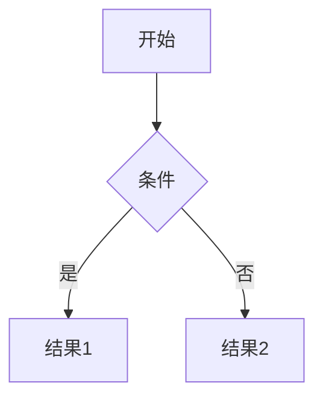

# CLAUDE.md

This file provides guidance to Claude Code (claude.ai/code) when working with code in this repository.

## 项目概述

这是一个基于 Docusaurus 3.6.3 构建的技术博客网站，专注于软件开发和人工智能领域。主要使用中文，支持 i18n（中英文）。目前包含 **543+ 篇技术文档**和多篇博客文章。

**技术栈:**
- Docusaurus 3.6.3
- React 18.2
- TypeScript 5.1
- KaTeX (数学公式)
- Mermaid (流程图)
- Giscus (GitHub Discussions 评论系统)

**系统要求:** Node.js >= 18.0

## 项目结构

```
yiwen-blog-website/
├── blog/                    # 博客文章 (年度总结、技术分享等)
├── docs/                    # 技术文档 (按领域分类)
│   ├── ai/                  # 人工智能
│   │   ├── applications/    # AI 应用
│   │   ├── architectures/   # 模型架构 (CNN, Transformer等)
│   │   ├── deployment/      # 模型部署
│   │   ├── frameworks/      # 框架 (PyTorch, HuggingFace等)
│   │   ├── fundamentals/    # 基础概念
│   │   ├── nlp/            # 自然语言处理
│   │   ├── optimization/    # 优化技术
│   │   └── python/         # Python 相关
│   ├── backend/            # 服务端开发
│   │   ├── architecture/   # 系统架构
│   │   ├── devops/        # DevOps
│   │   ├── docker/        # Docker
│   │   ├── go/            # Go 语言
│   │   ├── java/          # Java
│   │   ├── k8s/           # Kubernetes
│   │   ├── mongodb/       # MongoDB
│   │   ├── mysql/         # MySQL
│   │   └── redis/         # Redis
│   ├── cs_base/           # 计算机基础
│   │   ├── arithmetic/    # 算法
│   │   ├── compression/   # 压缩算法
│   │   ├── cs_internet/   # 计算机网络
│   │   ├── pattern/       # 设计模式
│   │   └── web_pattern/   # Web 架构模式
│   ├── math/              # 数学
│   │   └── probability/   # 概率论
│   ├── native/            # 客户端开发
│   │   ├── android/       # Android
│   │   ├── flutter/       # Flutter
│   │   ├── harmony/       # 鸿蒙
│   │   ├── ios/           # iOS
│   │   └── ReactNative/   # React Native
│   ├── web/               # Web 开发
│   │   ├── Antd/          # Ant Design
│   │   ├── Css/           # CSS
│   │   ├── Js/            # JavaScript
│   │   ├── Mini/          # 小程序
│   │   ├── Nextjs/        # Next.js
│   │   ├── React/         # React
│   │   ├── Rollup/        # Rollup
│   │   ├── taro/          # Taro
│   │   └── Umi/           # UmiJS
│   └── whelk/             # 个人内容
├── src/
│   ├── components/        # React 组件
│   │   └── Comment.tsx    # Giscus 评论组件
│   ├── css/               # 样式文件
│   │   ├── custom.css     # 全局自定义样式
│   │   └── taro/          # Taro 相关样式
│   ├── pages/             # 自定义页面
│   │   └── index.tsx      # 首页
│   └── theme/             # 主题覆盖 (Swizzled)
│       ├── BlogPostPage/  # 博客页面 (添加评论)
│       └── DocItem/       # 文档页面 (添加评论)
├── static/                # 静态资源
├── docusaurus.config.js   # Docusaurus 配置 (异步模式)
├── sidebars.js            # 侧边栏配置 (全自动生成)
└── Dockerfile             # Docker 部署配置
```

## 常用命令

```bash
# 开发
npm install          # 安装依赖
npm start           # 启动开发服务器 (localhost:3000)

# 构建和部署
npm run build       # 构建生产站点
npm run serve       # 本地预览构建
npm run deploy      # 部署到 GitHub Pages

# 代码质量
npm run typecheck   # TypeScript 类型检查
npm run lint:css    # CSS 检查 (Stylelint)
npm run clear       # 清除 Docusaurus 缓存
```

## 核心配置

### docusaurus.config.js
- **Base URL:** `/yiwen-blog-website/` (GitHub Pages)
- **i18n:** `zh` (默认), `en`
- **Markdown:** MDX 格式，支持 Mermaid 图表
- **数学公式:** remark-math + rehype-katex
- **搜索:** `@easyops-cn/docusaurus-search-local` (支持中英文)
- **侧边栏:** 全局禁用折叠 (`sidebarCollapsed: false`)
- **配置模式:** 使用 `async function createConfig()` 异步函数

### sidebars.js
所有侧边栏使用 `type: 'autogenerated'`，目录结构直接决定导航：
```js
{
  aiSidebar: [{type: 'autogenerated', dirName: 'ai'}],
  backendSidebar: [{type: 'autogenerated', dirName: 'backend'}],
  nativeSidebar: [{type: 'autogenerated', dirName: 'native'}],
  webSidebar: [{type: 'autogenerated', dirName: 'web'}],
  csSidebar: [{type: 'autogenerated', dirName: 'cs_base'}],
  mathSidebar: [{type: 'autogenerated', dirName: 'math'}],
  whelkSidebar: [{type: 'autogenerated', dirName: 'whelk'}],
}
```

### 代码高亮
支持语言: `swift`, `java`, `bash`, `dart`, `go`, `sql`, `objectivec`, `cpp`, `ruby`, `kotlin`

### 代码质量工具
- **Prettier** - 格式化 (tabWidth: 4, singleQuote: true, semi: true)
- **Stylelint** - CSS 检查 (允许单位: em, rem, s, %, px)
- **CommitLint** - Conventional commits
- **lint-staged** - 提交时自动检查 (*.js, *.json, *.md, *.ts, src/**/*.css)

## 主题定制

项目通过 Docusaurus Swizzle 机制自定义了以下组件：

### DocItem/Layout (`src/theme/DocItem/Layout/index.tsx`)
- 在文档页面底部添加 Giscus 评论组件

### BlogPostPage (`src/theme/BlogPostPage/index.tsx`)
- 在博客文章底部添加 Giscus 评论组件

### Comment 组件 (`src/components/Comment.tsx`)
- 使用 `@giscus/react` 实现
- 配置: repo=`Hao-yiwen/yiwen-blog-website`, 主题自适应

## Git 工作流

### Pre-commit Hooks (Husky)
```bash
# pre-commit: 运行 lint-staged
npx lint-staged

# commit-msg: 验证提交信息
npx commitlint --edit "$1"
```

### Conventional Commits 格式
```bash
feat: 添加新功能
fix: 修复问题
docs: 更新文档
style: 代码格式 (不影响功能)
refactor: 重构代码
chore: 构建/工具更新
perf: 性能优化
test: 添加测试
```

### CI/CD
- **master 分支:** 自动部署到 GitHub Pages (通过 `npm run deploy`)
- **v* 标签:** 触发 Docker 镜像构建并推送到阿里云容器镜像服务

### 分支策略
- `master` - 生产分支
- `claude/*` - Claude Code 开发分支
- 功能分支使用描述性名称

## 开发指南

### 添加新文档
1. 在 `docs/` 对应目录创建 `.md` 或 `.mdx` 文件
2. 添加 frontmatter:
   ```yaml
   ---
   title: 文档标题
   sidebar_position: 1        # 可选，控制排序
   tags: [tag1, tag2]        # 可选
   ---
   ```
3. 文档会自动出现在侧边栏 (autogenerated)
4. 使用 `_category_.json` 配置目录元信息

### 添加博客
在 `blog/` 目录创建文件:
```yaml
---
title: 文章标题
authors: [yiwen]
tags: [react, tutorial]
date: 2024-11-15
---

文章内容...

<!--truncate-->

更多内容 (摘要截断点之后)...
```

### 数学公式 (KaTeX)
```markdown
行内: $E = mc^2$

块级:
$$
f(x) = \int_{-\infty}^{\infty} e^{-x^2} dx
$$
```

### Mermaid 图表
````markdown

````

### MDX 组件
所有 markdown 文件支持 React 组件:
```jsx
import Tabs from '@theme/Tabs';
import TabItem from '@theme/TabItem';

<Tabs>
  <TabItem value="js" label="JavaScript">
    JavaScript 内容
  </TabItem>
  <TabItem value="py" label="Python">
    Python 内容
  </TabItem>
</Tabs>
```

## Docker 部署

### Dockerfile (多阶段构建)
1. **构建阶段:** Node 16 Alpine, yarn 安装依赖并构建
2. **运行阶段:** Nginx Alpine, 复制构建产物

### 构建命令
```bash
# 本地构建 (指定平台)
docker build --platform linux/amd64 -t yiwen-blog .

# 运行
docker run -p 80:80 yiwen-blog
```

## 重要提示

1. **配置模式:** `docusaurus.config.js` 使用异步函数模式 (`async function createConfig()`)，添加插件时保持此模式
2. **内容语言:** 中文为主，添加新文档直接放在 `docs/` 对应目录即可自动生成导航
3. **Docker 平台:** 目标平台 `linux/amd64`
4. **提交规范:** 必须符合 Conventional Commits 规范
5. **开发验证:** 添加或修改文档时，直接写入文件即可，无需运行构建命令验证
6. **评论系统:** Giscus 基于 GitHub Discussions，已集成到 Doc 和 Blog 页面

## 故障排查

```bash
# 构建失败
npm run clear
rm -rf node_modules package-lock.json
npm install

# 类型检查失败
npm run typecheck

# CSS 检查失败
npm run lint:css

# 重建搜索索引
npm run build
```

## 资源链接

- [Docusaurus 文档](https://docusaurus.io/docs)
- [KaTeX 支持符号](https://katex.org/docs/supported.html)
- [Mermaid 语法](https://mermaid.js.org/intro/)
- [Giscus 配置](https://giscus.app/)
- [Conventional Commits](https://www.conventionalcommits.org/)

## 联系方式

- GitHub: [@Hao-yiwen](https://github.com/Hao-yiwen)
- 网站: https://hao-yiwen.github.io/yiwen-blog-website/
