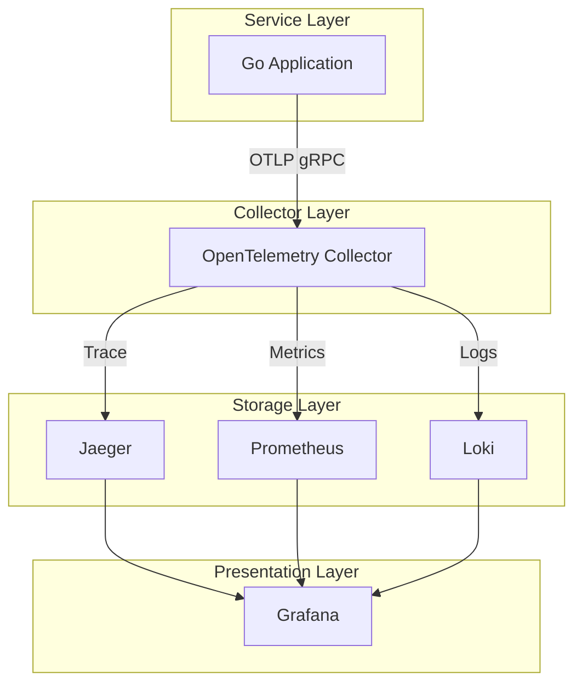

# 后端稳定性与可观测性实践：OpenTelemetry 深度解析与实战

<!-- truncate -->

## 1. 引言：软件稳定性的基石

在现代分布式系统架构中，服务数量的急剧增加使得系统的复杂性呈指数级上升。"系统是否在运行"（Monitoring）已不足以应对故障，工程团队迫切需要回答"系统为什么表现出这种行为"（Observability）。

后端稳定性是业务连续性的核心保障。缺乏可观测性的系统就像黑盒，故障排查如同大海捞针，直接导致：

- **MTTR (平均修复时间) 延长**：开发人员花费 80% 的时间定位问题，仅 20% 解决问题。
- **用户体验受损**：在用户投诉前无法感知性能退化。
- **盲目扩容**：无法精准识别瓶颈，导致资源浪费。

可观测性 (Observability) 通过主动暴露出系统的内部状态，赋予我们"白盒"视角，成为保障后端稳定性的终极武器。

## 2. 可观测性的三大支柱 (The Three Pillars)

要构建完整的可观测性体系，必须覆盖以下三个维度的数据信号：

### 2.1 Trace（分布式链路追踪）

**"请求的生命周期与路径"** Trace 记录了一个请求从前端进入，经过各个微服务、数据库、缓存，最终返回的全过程。

- **核心价值**：定位延迟瓶颈和错误根因。
- **场景**：API 响应慢，Trace 可以一针见血指出是 SQL 查询慢，还是下游服务调用超时。

### 2.2 Metric（指标监控）

**"基于时间序列的聚合数据"** Metric 是随时间变化的数值数据，反映系统的整体健康状况。

- **核心价值**：发现趋势和异常，触发告警。
- **场景**：CPU 使用率、QPS（每秒请求数）、P99 延迟、错误率。

### 2.3 Log（日志）

**"离散的事件记录"** Log 提供了特定时间点发生的详细信息。

- **核心价值**：提供上下文细节。
- **场景**：具体的异常堆栈 (Stack Trace)、业务逻辑判断结果、参数状态。

**三者的协同效应**： Metric 发现异常（报警） -> Trace 定位问题范围（哪个服务、哪个接口） -> Log 查明具体原因（代码逻辑）。

## 3. OpenTelemetry：云原生可观测性标准

过去，Trace、Metric、Log 往往由不同的工具栈管理（如 Jaeger + Prometheus + ELK），导致数据割裂，维护成本高昂。

**OpenTelemetry (OTel)** 应运而生。作为 CNCF 的顶级项目，它提供了一套统一的、厂商无关的标准，用于生成、收集、处理和导出遥测数据。

### OTel 的核心优势

- **统一 SDK**：一套 API 同时处理 Trace、Metric 和 Log。
- **上下文传播 (Context Propagation)**：自动注入 TraceID，让 Metric 和 Log 天然关联。
- **开放协议 (OTLP)**：数据生成与存储后端解耦。你可以随时更换后端（如从 Jaeger 换到 Datadog），而无需修改一行业务代码。

## 4. 实战架构：构建生产级 Demo

为了验证上述理论，我们基于 Go 语言和 Docker 构建了一套完整的可观测性演示系统。

### 4.1 技术栈概览

| 组件层级 | 技术选型 | 备注 |
|---------|---------|------|
| 应用层 | Go (Golang) | 使用 otel-go SDK 自动埋点 |
| 采集层 | OTel Collector | 统一的数据处理网关 |
| Trace 存储 | Jaeger | 分布式追踪系统 |
| Metric 存储 | Prometheus | 时序数据库标准 |
| Log 存储 | Loki | 高效的日志聚合系统 |
| 可视化 | Grafana | 统一的数据展示看板 |

### 4.2 数据流设计 (Data Pipeline)

我们的架构设计遵循 Sidecar/Agent 模式，应用不直接连接存储后端，而是统一发送给 Collector。

### 4.3 关键实现解析

#### A. 统一的自动埋点与上下文在日志中的透传

我们在 Go 应用中集成了 `otelhttp` 和 `otelslog`。

- **HTTP 自动注入**：每个请求由 `otelhttp` 中间件拦截，自动生成 Root Span，并记录 HTTP Method, Route, Status Code 等属性。
- **日志关联 (Log Correlation)**：通过 `otelslog`，所有应用日志自动附带当前的 TraceID 和 SpanID。这使得在 Loki 中查看日志时，可以直接跳转到 Jaeger 查看对应的 Trace。

#### B. OTel Collector 的网关作用

Collector 是本架构的枢纽，配置了三个核心 Processing Pipelines：

- **Traces Pipeline**: 接收 -> Batch 处理 -> 导出到 Jaeger (gRPC)。
- **Metrics Pipeline**: 接收 -> Batch 处理 -> 暴露 Prometheus Scrape 端点。
- **Logs Pipeline**: 接收 -> Batch 处理 -> 导出到 Loki (HTTP)。

这种设计极大地简化了应用的配置——应用只需要知道 Collector 的地址，不需要关心后端的具体实现。

#### C. 基础设施隔离

我们利用 Docker Compose 的网络隔离和 DNS 服务发现机制，确保各组件在 `otel-network` 内部互通，同时通过端口映射对宿主机暴露可视化界面。这模拟了真实的生产环境网络拓扑。

## 5. 总结与展望

通过本次 Demo 的搭建，我们不仅实现了一个功能完备的可观测性平台，更深刻理解了**"数据关联"**的价值。当 Trace 的火焰图与 Metric 的曲线图、Log 的详细记录在 Grafana 大盘中联动展示时，系统的透明度达到了前所未有的高度。

这套架构完全具备向生产环境迁移的能力。未来的演进方向可以包括：

- **引入 Alertmanager**：基于 Metric 趋势配置自动报警。
- **采样策略 (Sampling)**：在 Collector 层配置尾部采样 (Tail Sampling)，只保留异常或慢请求的 Trace，降低存储成本。
- **持久化存储**：将 Jaeger 和 Loki 的后端对接至对象存储 (S3) 或 Elasticsearch，实现长期数据保留。
