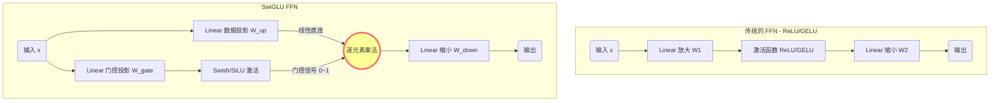

# 技术文档：SwiGLU (Swish-Gated Linear Unit)

## 1. 概述

**SwiGLU** 全称为 **Swish-Gated Linear Unit**（采用 Swish 激活函数的门控线性单元）。它是一种用于替代 Transformer 架构中传统前馈神经网络（FFN / MLP）层的网络结构。

SwiGLU 由 Google 研究员 Noam Shazeer 在 2020 年的论文 *"GLU Variants Improve Transformer"* 中提出。该论文通过大量实验证明，在参数量相同的情况下，采用门控机制（GLU）的 FFN 变体在性能上显著优于标准的 ReLU 或 GELU FFN。而在众多变体中，SwiGLU 通常表现最佳，现已成为大模型时代的"工业标准"。

## 2. 背景：从标准 FFN 到 SwiGLU

为了理解 SwiGLU，我们首先需要回顾它所取代的对象。

### 2.1. 传统的标准 FFN (Standard FFN)

在最初的 Transformer (如 BERT, GPT-2) 中，FFN 层是一个简单的两层全连接网络，其工作流程是"先放大，后激活，再缩小"：

1.  将输入维度从 $d$ 扩展到 $4d$（通常是 4 倍）。
2.  经过一个非线性激活函数（如 ReLU 或 GELU）。
3.  将维度从 $4d$ 投影回 $d$。

数学公式如下：

$$\text{FFN}(x) = \text{Activation}(x W_{1}) W_{2}$$

*注：$W_1$ 形状为 $[d, 4d]$，$W_2$ 形状为 $[4d, d]$。总共涉及 **2 个** 权重矩阵。*

### 2.2. SwiGLU FFN 的演进

SwiGLU 引入了两个核心概念来改进上述结构：

1.  **门控机制 (Gating Mechanism)**：不再是单一的信息流通路径，而是并行计算两条路径，并通过乘法进行控制。
2.  **Swish (SiLU) 激活函数**：使用更平滑的激活函数替代 ReLU/GELU。

SwiGLU FFN 结构包含 **3 个** 权重矩阵（通常不使用偏置 bias）：

  * $W_{gate}$: 用于计算门控信号。
  * $W_{up}$: 用于计算数据信息流。
  * $W_{down}$: 用于输出投影。

其数学公式如下：

$$\text{SwiGLU}(x) = (\underbrace{\text{SiLU}(x W_{gate})}_{\text{门控路径 (Gate Path)}} \otimes \underbrace{(x W_{up})}_{\text{数据路径 (Data Path)}}) W_{down}$$

符号说明：

  * $\otimes$ 表示**逐元素乘法** (Element-wise multiplication)。
  * **SiLU** 是 Sigmoid Linear Unit 的缩写，即 $\beta=1$ 时的 Swish 函数：$f(x) = x \cdot \text{Sigmoid}(x) = \frac{x}{1+e^{-x}}$。

### 2.3. 结构对比示意图



---

## 3. SwiGLU 的核心优势

SwiGLU 之所以能成为主流，主要归功于以下两点优势的结合：

### 3.1. 更强的表达能力（门控与乘法交互）

传统的 FFN 通过激活函数来抑制或保留特征，这是一种相对简单的非线性。

SwiGLU 引入了**逐元素乘法交互**。门控路径经过 Sigmoid 计算（包含在 SiLU 中）后，输出值在 0 到 1 之间波动，就像一个可学习的"阀门"。这个阀门会根据输入数据自身的特性，动态地控制数据路径中信息的通过比例。

这种"自我调节"的乘法机制比单纯的加法（矩阵乘法本质是加权求和）具有更强的特征组合和表达能力。

### 3.2. 更优秀的梯度传播特性（平滑性与线性路径）

在大规模深层网络的训练中，梯度流的稳定性至关重要。

  * **Swish (SiLU) 的平滑性**：与 ReLU 在 0 点处不可导的硬折角不同，SiLU 是处处可导的光滑曲线，且在负半轴具有非单调的特性（允许少量的负梯度流过）。这有助于优化过程，减少梯度爆炸或消失的风险。
  * **线性数据路径**：在 SwiGLU 结构中，有一条路径 $(x W_{up})$ 是**纯线性**的，没有经过任何激活函数。这种直连的线性成分非常有助于梯度在深层网络中顺畅地向后传播。

---

## 4. 工程考量：参数效率与维度调整

一个关键的问题是：SwiGLU 使用了 3 个矩阵，而标准 FFN 只有 2 个。如果保持中间层维度（hidden dimension）不变（例如仍然放大 4 倍），SwiGLU 的参数量将增加 50%。

为了在相同的计算预算下公平比较或替换旧架构，业界采取的做法是**缩小中间层的放大倍数**。

### 4.1. 参数量计算对比

设输入/输出维度为 $d$，中间层维度为 $h$。

  * **标准 FFN (2个矩阵)**：

      * 总参数量 $\approx 2 \times d \times h$
      * 通常 $h = 4d$，则总参数量 $\approx 8d^2$。

  * **SwiGLU FFN (3个矩阵)**：

      * 总参数量 $\approx 3 \times d \times h_{new}$

### 4.2. 维持参数恒定

为了使 SwiGLU 的总参数量与标准 FFN 保持一致（即维持在 $8d^2$ 左右），我们需要调整新的中间维度 $h_{new}$：

$$3 \cdot d \cdot h_{new} \approx 8d^2$$
$$h_{new} \approx \frac{8}{3}d \approx 2.67d$$

**结论：** 在实际应用（如 LLaMA）中，使用 SwiGLU 时，FFN 中间层的放大倍数不再是传统的 **4 倍**，而是调整为约 **2/3 的 4 倍**（即约 2.67 倍），以保证模型总参数量和计算量大致不变。

---

## 5. PyTorch 代码实现

在实际的工业级代码库（如 Hugging Face Transformers 或 Megatron-LM）中，为了提高 GPU 计算效率，通常会将前两个并行的线性层（$W_{gate}$ 和 $W_{up}$）合并为一个大的矩阵乘法操作。

以下是 SwiGLU FFN 的高效实现方式：

```python
import torch
import torch.nn as nn
import torch.nn.functional as F

class SwiGLUFFN(nn.Module):
    """
    SwiGLU FFN 层的优化实现。

    Args:
        d_model (int): 输入和输出的特征维度。
        hidden_dim (int): FFN 中间层的维度。
                          在使用 SwiGLU 时，这个值通常约为 (8/3) * d_model，
                          而不是传统的 4 * d_model。
        bias (bool): 是否使用偏置项。现代大模型通常设为 False。
    """
    def __init__(self, d_model: int, hidden_dim: int, bias: bool = False):
        super().__init__()

        # 1. 合并投影层 (Fused Gate and Up Projection)
        # 我们将 W_gate 和 W_up 合并为一个大的线性层。
        # 输出维度是 2 * hidden_dim。
        # 前一半用于门控信号，后一半用于数据信号。
        self.gate_up_proj = nn.Linear(d_model, 2 * hidden_dim, bias=bias)

        # 2. 向下投影层 (Down Projection)
        # 将维度从 hidden_dim 投影回 d_model。
        self.down_proj = nn.Linear(hidden_dim, d_model, bias=bias)

        # 3. 激活函数
        # PyTorch 中的 nn.SiLU() 等价于 Swish (beta=1)
        self.act = nn.SiLU()

    def forward(self, x: torch.Tensor) -> torch.Tensor:
        # 假设输入 x 的形状为 [batch_size, seq_len, d_model]

        # Step 1: 一次性计算门控和数据投影
        # projected_shape: [batch_size, seq_len, 2 * hidden_dim]
        fused_proj = self.gate_up_proj(x)

        # Step 2: 将结果在最后一个维度切分为两半
        # gate_proj 和 up_proj 的形状均为 [batch_size, seq_len, hidden_dim]
        gate_proj, up_proj = fused_proj.chunk(2, dim=-1)

        # Step 3: 执行核心 SwiGLU 操作
        # (SiLU(gate) * up)
        gated_hidden = self.act(gate_proj) * up_proj

        # Step 4: 投影回原始维度
        output = self.down_proj(gated_hidden)

        return output

# --- 使用示例 ---
if __name__ == '__main__':
    batch_size, seq_len, d_model = 2, 128, 4096

    # 计算 SwiGLU 的中间维度，保持参数量与传统的 4倍放大 FFN 大致相同
    # hidden_dim ≈ (8/3) * d_model
    hidden_dim = int(d_model * 8 / 3)
    # 为了 GPU 效率，通常将其取整为 128 或 256 的倍数 (例如 LLaMA-7B 中为 11008)
    hidden_dim = ((hidden_dim + 255) // 256) * 256
    print(f"Model dimension: {d_model}, Hidden dimension: {hidden_dim}")

    # 初始化模块
    swiglu_ffn = SwiGLUFFN(d_model=d_model, hidden_dim=hidden_dim, bias=False)

    # 创建虚拟输入
    x = torch.randn(batch_size, seq_len, d_model)

    # 前向传播
    output = swiglu_ffn(x)

    print(f"Input shape: {x.shape}")
    print(f"Output shape: {output.shape}")
    # 验证输出形状是否与输入一致
    assert output.shape == x.shape
    print("SwiGLU FFN forward pass successful.")
```

## 6. 总结

SwiGLU 是对传统 Transformer FFN 的一项重要升级。它通过引入**门控机制**和**乘法交互**提升了模型的表达能力，并利用 **Swish (SiLU)** 激活函数的平滑特性改善了训练时的梯度流。

虽然其结构包含三个矩阵，但通过合理调整中间层维度（约 $2.67d$），可以在不增加总参数量和计算预算的前提下，显著提升大型语言模型的性能和训练稳定性。这使其成为当前最先进 LLM 架构的首选方案。
