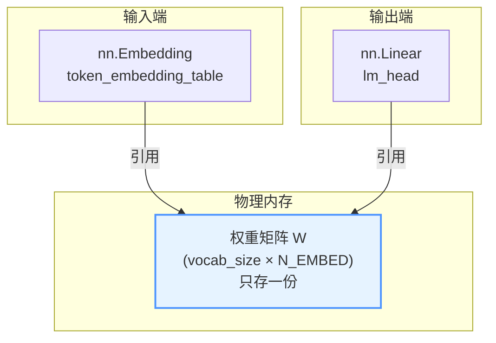
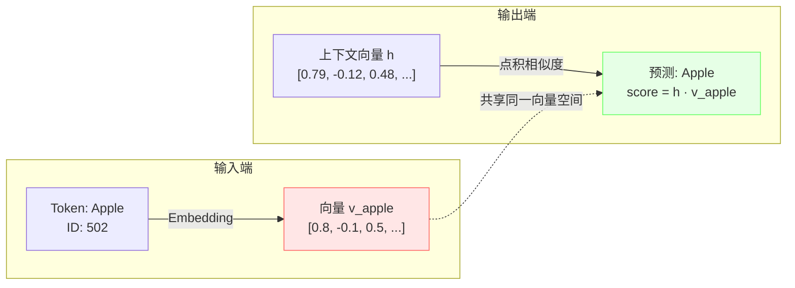

import weightShare from '@site/static/img/weight_share.png';

# Weight Sharing (权重共享) 技术文档

## 1. 概述 (Overview)

**权重共享（Weight Tying/Sharing）** 是现代语言模型中的一种重要优化技术，核心思想是：**模型的输入层（Token Embedding）和输出层（Language Model Head）共用同一个权重矩阵。**

这一技术由 Press & Wolf (2016) 在论文 *"Using the Output Embedding to Improve Language Models"* 中首次系统性提出，并被 GPT-2、GPT-3、LLaMA 等主流大语言模型广泛采用。

### 核心价值

- **减少参数量：** 节省约 30-50% 的 Embedding 相关参数（对于大词表模型非常可观）。
- **提升模型效果：** 通过强制语义对齐，实际上能降低困惑度（Perplexity）。
- **正则化效果：** 减少过拟合风险，提升模型泛化能力。

---

## 2. 工作原理 (How It Works)

### 2.1 代码实现

在 NanoGPT 的 `GPTLanguageModel` 类中，权重共享的实现非常简洁：

```python
class GPTLanguageModel(nn.Module):
    def __init__(self, vocab_size):
        super().__init__()
        # 输入层：Token Embedding
        self.token_embedding_table = nn.Embedding(vocab_size, N_EMBED)

        # 输出层：Language Model Head
        self.lm_head = nn.Linear(N_EMBED, vocab_size, bias=False)

        # 权重共享：Embedding 与 LM Head 共用同一权重矩阵
        self.lm_head.weight = self.token_embedding_table.weight
```

### 2.2 内存层面的理解

在 PyTorch 中，`nn.Parameter` 是对张量的封装。当执行 `self.lm_head.weight = self.token_embedding_table.weight` 时：

- **物理存储：** 内存中只存在 **一份** 形状为 `(vocab_size, N_EMBED)` 的张量。
- **逻辑层面：**
  - `token_embedding_table` 将其视为 **查找表（Look-up Table）**
  - `lm_head` 将其视为 **线性变换矩阵（Linear Projection）**
- **梯度更新：** 反向传播时，同时累积来自输入端和输出端的梯度，更新时同步更新。



### 2.3 维度匹配

你可能会疑惑 `nn.Embedding` 和 `nn.Linear` 的形状是否匹配：

| 组件 | 权重形状 | 说明 |
|:-----|:--------|:-----|
| `nn.Embedding(V, D).weight` | `(V, D)` | 词表大小 × 嵌入维度 |
| `nn.Linear(D, V).weight` | `(V, D)` | PyTorch 存储为 `(out_features, in_features)` |

它们在内存中的形状 **完全一致**，可以直接赋值，无需转置操作。

---

## 3. 为什么要这样做？

### 3.1 语义一致性 (Semantic Consistency)

这是权重共享最核心的理论依据：

- **输入端：** Embedding 层将 Token ID（如 "Apple"）转换为语义向量 $v_{apple}$
- **输出端：** LM Head 计算上下文向量 $h$ 与词表中所有词的相似度（点积）

**直觉理解：** 如果模型在输入端认为向量 $v$ 代表 "Apple"，那么在输出端，当模型想要预测 "Apple" 时，它生成的上下文向量应该与 $v$ 最相似。



### 3.2 减少参数量 (Parameter Efficiency)

这是最直接的工程优势。词汇表通常很大，Embedding 矩阵占用大量参数：

**参数量计算示例：**

| 模型 | vocab_size | N_EMBED | 单个矩阵参数量 | 节省量 |
|:-----|:-----------|:--------|:--------------|:-------|
| NanoGPT | 50,257 | 768 | ~38.6M | ~38.6M |
| GPT-2 | 50,257 | 1,024 | ~51.5M | ~51.5M |
| LLaMA-7B | 32,000 | 4,096 | ~131M | ~131M (~500MB 显存) |
| LLaMA-70B | 32,000 | 8,192 | ~262M | ~262M (~1GB 显存) |

$$
\text{节省参数量} = \text{vocab\_size} \times \text{N\_EMBED}
$$

### 3.3 正则化效果 (Regularization)

参数量减少带来的额外好处：

- **减少过拟合风险：** 更少的参数意味着更少的过拟合机会
- **强制特征共享：** 模型被迫学习一个既能表示输入特征，又能作为输出分类依据的 **通用特征空间**
- **双向梯度更新：** 共享权重同时接收来自输入端和输出端的梯度，对低频词尤为有益

---

## 4. 对模型效果的影响

### 4.1 学术结论

根据 Press & Wolf (2016) 及后续研究：

> 在大多数语言建模任务中，权重共享 **显著降低了困惑度（Perplexity）**，即提升了预测准确率。

### 4.2 效果对比

| 配置 | 参数量 | 困惑度 (PPL) | 训练稳定性 |
|:-----|:------|:------------|:----------|
| 不共享权重 | 基准 | 基准 | 一般 |
| 共享权重 | ↓ 显著减少 | ↓ 通常更低 | ↑ 更稳定 |


### 4.3 为什么通常提升效果？

**A. 强制语义对齐（强正则化）**

- **不共享时：** 输入 Embedding 只需学习"如何被后续层识别"，输出 Linear 只需学习"如何分类"，可能学出两套完全不同的向量分布
- **共享时：** 强制要求输入表示和输出预测目标位于同一几何空间

**B. 训练效率更高**

- 共享权重同时接收来自输入端和输出端的梯度信号
- 对 **低频词（Rare Words）** 尤为重要——双倍的梯度让它们被学习得更好

---

## 5. 实现细节与注意事项

### 5.1 必须设置 `bias=False`

```python
self.lm_head = nn.Linear(N_EMBED, vocab_size, bias=False)  # ✅ 正确
self.lm_head = nn.Linear(N_EMBED, vocab_size, bias=True)   # ❌ 不推荐
```

**原因：** `nn.Embedding` 没有偏置项（Bias），如果 `lm_head` 带有 Bias，虽然权重矩阵可以共享，但 Bias 无法共享，导致逻辑不对称。

### 5.2 缩放技巧 (Scaling)

在原始 Transformer 论文 *"Attention Is All You Need"* 中，Embedding 层输出后会乘以 $\sqrt{d_{model}}$：

```python
# 原代码
tok_emb = self.token_embedding_table(idx)

# 改进：乘以 sqrt(d_model)
tok_emb = self.token_embedding_table(idx) * math.sqrt(N_EMBED)
```

**为什么？**

- Embedding 权重初始化通常较小（方差约 $1/d$）
- 经过多层 LayerNorm 和残差连接后，数值分布会变化
- 缩放可以使 Embedding 数值更适合进入后续 Attention 层，保持数值稳定性

### 5.3 初始化策略

由于权重被共享，初始化需要同时考虑两个用途：

```python
# 常见初始化方式
nn.init.normal_(self.token_embedding_table.weight, mean=0.0, std=0.02)
# lm_head.weight 自动共享，无需单独初始化
```

---

## 6. 完整代码示例

### 6.1 NanoGPT 风格实现

```python
import torch
import torch.nn as nn
import math

class GPTLanguageModel(nn.Module):
    def __init__(self, vocab_size, n_embed, n_layer, n_head, block_size, dropout=0.1):
        super().__init__()

        # Token Embedding
        self.token_embedding_table = nn.Embedding(vocab_size, n_embed)
        # Position Embedding
        self.position_embedding_table = nn.Embedding(block_size, n_embed)

        # Transformer Blocks
        self.blocks = nn.Sequential(*[
            TransformerBlock(n_embed, n_head, block_size, dropout)
            for _ in range(n_layer)
        ])

        # Final LayerNorm
        self.ln_f = nn.LayerNorm(n_embed)

        # Language Model Head (输出层)
        self.lm_head = nn.Linear(n_embed, vocab_size, bias=False)

        # 🔑 权重共享：核心代码
        self.lm_head.weight = self.token_embedding_table.weight

        # 初始化
        self.apply(self._init_weights)

    def _init_weights(self, module):
        if isinstance(module, nn.Linear):
            torch.nn.init.normal_(module.weight, mean=0.0, std=0.02)
            if module.bias is not None:
                torch.nn.init.zeros_(module.bias)
        elif isinstance(module, nn.Embedding):
            torch.nn.init.normal_(module.weight, mean=0.0, std=0.02)

    def forward(self, idx, targets=None):
        B, T = idx.shape

        # Token + Position Embedding
        tok_emb = self.token_embedding_table(idx)  # (B, T, C)
        pos_emb = self.position_embedding_table(torch.arange(T, device=idx.device))  # (T, C)
        x = tok_emb + pos_emb  # (B, T, C)

        # Transformer Blocks
        x = self.blocks(x)
        x = self.ln_f(x)

        # 输出 Logits
        logits = self.lm_head(x)  # (B, T, vocab_size)

        # 计算 Loss
        if targets is None:
            loss = None
        else:
            B, T, C = logits.shape
            logits = logits.view(B*T, C)
            targets = targets.view(B*T)
            loss = F.cross_entropy(logits, targets)

        return logits, loss
```

### 6.2 验证权重确实共享

```python
model = GPTLanguageModel(vocab_size=50257, n_embed=768, ...)

# 验证两者指向同一内存地址
print(model.token_embedding_table.weight.data_ptr())
print(model.lm_head.weight.data_ptr())
# 输出相同的内存地址

# 验证两者是同一对象
print(model.token_embedding_table.weight is model.lm_head.weight)
# 输出: True
```

---

## 7. 什么时候不共享可能更好？

在极少数情况下，研究人员会选择解绑（Decouple）权重：

| 场景 | 原因 |
|:-----|:-----|
| **超大规模模型** | 数据和算力接近无限时，解绑可能让模型有更大自由度 |
| **多语言/特殊任务** | 输入和输出分布差异极大时 |
| **编码器-解码器架构** | 某些 Seq2Seq 模型可能不适合共享 |

但对于绝大多数场景（特别是 Decoder-only 的 GPT 架构），**权重共享是标准做法**。

---

## 8. 主流模型采用情况

| 模型 | 是否使用权重共享 | 备注 |
|:-----|:---------------|:-----|
| GPT-2 | ✅ 是 | 开创性采用 |
| GPT-3 | ✅ 是 | 沿用 GPT-2 设计 |
| LLaMA | ✅ 是 | 明确在论文中说明 |
| LLaMA 2/3 | ✅ 是 | 继承 LLaMA 设计 |
| Mistral | ✅ 是 | 业界标准做法 |
| BERT | ✅ 是 | 在 MLM 任务中使用 |

---

## 9. 常见问题 (FAQ)

**Q: 权重共享会导致训练不稳定吗？**

A: 通常不会。相反，由于正则化效果，训练往往更稳定。如果遇到问题，可以尝试加入 $\sqrt{d_{model}}$ 缩放。

**Q: 我可以只在推理时解绑权重吗？**

A: 技术上可以（通过复制权重），但没有任何好处，反而会增加显存占用。

**Q: 共享权重对梯度计算有什么影响？**

A: 梯度会自动累积。PyTorch 的自动微分机制会正确处理共享参数的梯度，无需手动干预。

---

## 10. 总结

| 方面 | 结论 |
|:-----|:-----|
| **是否推荐** | ✅ 强烈推荐（现代 LLM 标准做法） |
| **参数节省** | vocab_size × N_EMBED（通常数千万参数） |
| **效果影响** | 通常 ↑ 提升（降低 PPL） |
| **实现复杂度** | 极低（一行代码） |

**核心代码：**
```python
self.lm_head.weight = self.token_embedding_table.weight
```

---

## 11. 参考资料

- [Using the Output Embedding to Improve Language Models](https://arxiv.org/abs/1608.05859) - Press & Wolf, 2016（权重共享原始论文）
- [Attention Is All You Need](https://arxiv.org/abs/1706.03762) - Vaswani et al., 2017
- [Language Models are Unsupervised Multitask Learners](https://d4mucfpksywv.cloudfront.net/better-language-models/language_models_are_unsupervised_multitask_learners.pdf) - GPT-2 论文
- [LLaMA: Open and Efficient Foundation Language Models](https://arxiv.org/abs/2302.13971) - Meta AI, 2023
