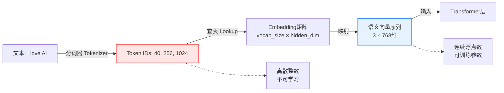
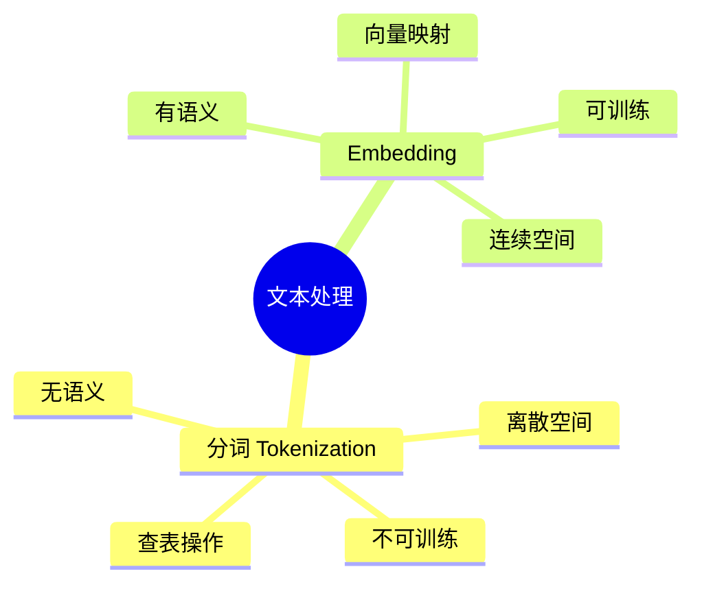

# 分词与Embedding：从文本到向量的两个关键步骤

## 核心概念

在大语言模型（LLM）中，**分词（Tokenization）**和**Embedding（词嵌入）**是文本处理的两个连续但本质完全不同的步骤：

- **分词**：将"人类语言"转换为"机器能索引的ID" 📑
- **Embedding**：将"ID"转换为"机器能理解的语义向量" 🧠

这就像去图书馆查资料：
1. **分词** = 查目录找到书的编号（索引）
2. **Embedding** = 打开那本书阅读内容（理解）

## 处理流程对比

### 图书馆类比

假设你要查关于"苹果"的资料：

**步骤1：分词（查目录）**
- **输入**：文本 "Apple"
- **动作**：在预先构建的词表（BPE词表）中查找
- **输出**：找到对应的 **ID 502**
- **特点**：纯粹的查表操作，无任何语义理解

**步骤2：Embedding（读内容）**
- **输入**：**ID 502**
- **动作**：在模型的Embedding矩阵中检索第502行
- **输出**：得到语义向量 `[0.8, -0.1, 0.5, ...]`
- **特点**：向量包含"红色"、"圆形"、"可食用"等语义信息

### 数据流程图



## 深度对比

| 维度 | 分词 (Tokenization) | Embedding (词嵌入) |
|:-----|:-------------------|:------------------|
| **数据类型** | 离散整数（Discrete）<br/>`[40, 256, 1024]` | 连续浮点数（Continuous）<br/>`[[0.12, -0.98, ...], ...]` |
| **是否可训练** | ❌ 固定不变<br/>训练前定好，训练中不改 | ✅ 动态调整<br/>训练过程中不断优化 |
| **包含语义** | ❌ 无语义<br/>ID 10和ID 11可能完全无关 | ✅ 有语义<br/>相似词向量距离近 |
| **维度** | 1维标量<br/>`502` | 高维向量<br/>`768/1024/4096维` |
| **数学运算** | 不可直接运算<br/>仅作索引使用 | 可进行向量运算<br/>加减乘除、点积等 |
| **给谁用** | Embedding层的输入索引 | Transformer各层的数学计算 |
| **存储位置** | 分词器的词表文件<br/>`tokenizer.json` | 模型权重矩阵<br/>`embedding.weight` |

## 为什么不能直接用Token ID计算？

### 问题演示

假设：
- "香蕉" → ID **10**
- "苹果" → ID **20**
- "西瓜" → ID **30**

如果直接用ID进行数学运算会出现**严重问题**：

❌ **大小关系混乱**
```python
西瓜(30) > 苹果(20) > 香蕉(10)  # 词汇没有大小之分！
```

❌ **虚假的数学关系**
```python
西瓜(30) = 香蕉(10) + 苹果(20)  # 完全没有意义！
```

❌ **相邻ID无语义关联**
```python
ID 100: "猫"
ID 101: "量子力学"  # ID相邻，但毫无关系
```

### Embedding的解决方案

将ID映射到**高维语义空间**（通常768/1024/4096维）：

```python
# 伪代码示例
embedding_matrix = torch.nn.Embedding(vocab_size=50257, embed_dim=768)

# 分词结果
token_ids = [10, 20, 30]  # [香蕉, 苹果, 西瓜]

# 转换为向量
embeddings = embedding_matrix(token_ids)
# Shape: [3, 768]
# 每个词都是768维的浮点数向量
```

在这个空间里：

✅ **相似词聚集**
```python
distance("苹果", "香蕉") = 0.12  # 距离很近（都是水果）
distance("苹果", "汽车") = 3.45  # 距离很远
```

✅ **支持语义运算**
```python
vector("国王") - vector("男人") + vector("女人") ≈ vector("女王")
```

## 代码示例：完整流程

### PyTorch实现

```python
import torch
import torch.nn as nn

# 1. 模拟分词结果（Token IDs）
text = "I love AI"
token_ids = torch.tensor([40, 256, 1024])  # 假设这是分词后的结果

# 2. 创建Embedding层
vocab_size = 50000  # 词表大小
embedding_dim = 768  # 向量维度（BERT-base规模）
embedding_layer = nn.Embedding(vocab_size, embedding_dim)

# 3. ID转向量
embeddings = embedding_layer(token_ids)

print(f"Token IDs: {token_ids}")
print(f"Embeddings shape: {embeddings.shape}")  # [3, 768]
print(f"第一个token的向量前5维: {embeddings[0, :5]}")
```

### 实际模型中的使用

```python
from transformers import GPT2Tokenizer, GPT2Model

# 初始化
tokenizer = GPT2Tokenizer.from_pretrained("gpt2")
model = GPT2Model.from_pretrained("gpt2")

# 文本输入
text = "Hello, how are you?"

# 步骤1：分词（Tokenization）
input_ids = tokenizer.encode(text, return_tensors="pt")
print(f"Token IDs: {input_ids}")
# Output: tensor([[15496,   11,   703,   389,   345,    30]])

# 步骤2：Embedding（在模型内部自动完成）
with torch.no_grad():
    outputs = model(input_ids)
    embeddings = outputs.last_hidden_state  # [1, 6, 768]

print(f"Embedding shape: {embeddings.shape}")
```

## 关键要点总结

### 本质区别



### 记忆口诀

> **分词是"编号"，Embedding是"内涵"**
>
> - 分词：给每个词发张**身份证**（ID）
> - Embedding：记录每个人的**详细档案**（向量）

### 训练过程中的变化

| 阶段 | 分词器 | Embedding矩阵 |
|:-----|:------|:-------------|
| **预训练前** | ✅ 已固定<br/>基于语料库训练 | 🎲 随机初始化 |
| **预训练中** | 🔒 保持不变 | 📈 不断优化学习语义 |
| **预训练后** | 🔒 冻结 | ✅ 学到丰富语义表示 |
| **微调** | 🔒 通常不变 | 🔄 继续调整适应新任务 |

## 常见误区

### ❌ 误区1：分词就是Embedding
```python
# 错误理解
"分词后直接得到向量" ❌
```
**正确**：分词得到的是整数ID，需要通过Embedding层转换为向量。

### ❌ 误区2：Token ID有语义信息
```python
# 错误理解
token_id = 502  # 认为502这个数字本身包含"苹果"的信息 ❌
```
**正确**：ID只是索引，语义信息存储在Embedding矩阵的第502行向量中。

### ❌ 误区3：Embedding层只是简单查表
```python
# 部分正确但不完整
embeddings = embedding_matrix[token_ids]  # ✅ 查表
# 但Embedding矩阵是可训练参数，训练中会更新！✅
```

## 拓展阅读

- [子词分词方法详解](./subword_tokenization.md)
- [Transformer完整实现](../architectures/transformer/transformer_complete_implementation.md)
- [为什么BPE成为主流](./why-bpe-is-mainstream.md)

## 参考资料

1. [Word2Vec论文](https://arxiv.org/abs/1301.3781) - Mikolov et al., 2013
2. [GloVe论文](https://nlp.stanford.edu/pubs/glove.pdf) - Pennington et al., 2014
3. [BERT论文](https://arxiv.org/abs/1810.04805) - Devlin et al., 2018
4. [GPT-2论文](https://d4mucfpksywv.cloudfront.net/better-language-models/language_models_are_unsupervised_multitask_learners.pdf) - Radford et al., 2019
