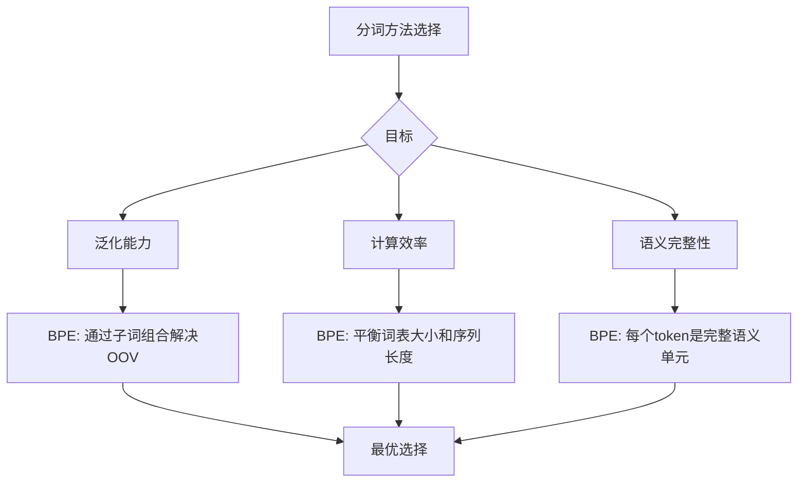

# 为什么 BPE 成为主流分词方法？深度技术解析

## 核心问题

从数学原理上讲，无论是基于词（Word）、字符（Character）还是 BPE（Subword），神经网络的核心任务都是**"根据上下文预测下一个 token 的概率"**。既然预测机制相同，为什么 BPE 会成为当今 GPT、BERT、LLaMA 等主流模型的标配？

**答案：BPE 的优势不在于预测机制本身，而在于工程上的完美权衡（Trade-off）。**

BPE 完美平衡了"词分词"和"字符分词"各自的致命缺陷，在以下三个核心维度上达到了黄金平衡点：

1. **泛化能力**：解决未登录词（OOV）问题
2. **计算效率**：参数量与序列长度的平衡
3. **语义完整性**：合理的语义单元粒度

---

## 一、三种分词方法的对比

### 1.1 词分词（Word-level Tokenization）

**原理**：将文本按照完整的词切分，每个词对应一个唯一的 ID。

```python
# 示例
句子: "The old computer is older"
词表: {"The": 1, "old": 2, "computer": 3, "is": 4, "older": 5}
编码: [1, 2, 3, 4, 5]
```

**优点**：
- 语义单元完整，一个词直接对应一个概念
- 序列长度短，信息密度高

**致命缺陷**：
- **词表爆炸**：覆盖所有英语单词需要 50 万+ 词表，中文更夸张
- **OOV 问题**：未见过的词（如新造词 "uninstagrammable"）只能标记为 `<UNK>`，导致信息完全丢失
- **形态学失效**：模型无法理解 `old`、`older`、`oldest` 之间的关系，必须分别学习每个词的 Embedding

### 1.2 字符分词（Character-level Tokenization）

**原理**：将文本拆分成单个字符，词表极小（26个字母 + 标点）。

```python
# 示例
句子: "AI"
编码: ['A', 'I']
```

**优点**：
- 词表极小（通常 < 100），没有 OOV 问题
- 模型参数最少

**致命缺陷**：
- **序列长度爆炸**：句子 "I like AI"（3 个 token）变成 9 个字符 token
- **计算复杂度激增**：Transformer 的 Attention 计算复杂度是 $O(N^2)$，序列变长会导致推理极慢
- **语义碎片化**：单个字符 `a` 无法预测下一个是 `p`（apple）还是 `n`（ant），模型需要更多层数来组合字符

### 1.3 BPE（Byte Pair Encoding）

**原理**：介于词和字符之间，通过统计频率将高频字符对合并成子词。

```python
# 示例
句子: "The GPU is overheating"
编码: ['The', 'GPU', 'is', 'over', 'heat', 'ing']
```

**核心思想**：
- 常见词（如 `the`、`is`）保持完整 → 保留语义完整性
- 罕见词（如 `overheating`）拆分成子词（`over` + `heat` + `ing`） → 通过组合理解含义

---

## 二、BPE 的三大核心优势

### 2.1 解决未登录词（OOV）与泛化能力

这是 BPE **碾压词分词**的最大优势。

#### 词分词的痛点

假设词表中有 `old`、`older`、`oldest`：
- 在神经网络眼中，它们是**完全独立**的 ID（如 `101`、`5002`、`8999`）
- 模型无法从 ID 上看出它们共享 `old` 这个词根，必须通过大量数据分别学习

**致命场景（OOV）**：
```python
输入: "This view is uninstagrammable"
词分词: ['This', 'view', 'is', '<UNK>']  # 信息丢失！
```

#### BPE 的解决方案

```python
BPE 分词: ['This', 'view', 'is', 'un', 'instagram', 'm', 'able']
```

**关键洞察**：
- 模型虽然没见过 `uninstagrammable` 这个完整词，但它见过：
  - `un-`：否定前缀（如 unhappy, unable）
  - `instagram`：名词（社交平台）
  - `-able`：形容词后缀（可...的）
- **结论**：BPE 让模型学会了**构词法（Morphology）**，即使是未见过的词，也能通过子词组合理解其含义

#### 实际案例

假设你训练了一个聊天机器人，用户输入了新词：

| 输入 | 词分词 | BPE 分词 | 模型理解 |
|------|--------|----------|----------|
| "uncancelable" | `<UNK>` | `un` + `cancel` + `able` | ✅ 理解为"不可取消的" |
| "retweet" | `<UNK>` | `re` + `tweet` | ✅ 理解为"转发推文" |
| "COVID-19" | `<UNK>` | `COVID` + `-` + `19` | ✅ 保留完整信息 |

**技术本质**：BPE 通过子词学习到了**组合语义**，泛化能力远超词分词。

---

### 2.2 参数量 vs. 计算效率的平衡

这是 BPE 能够**同时打败词分词和字符分词**的关键原因。

#### 核心权衡：词表大小 vs. 序列长度

| 分词方式 | 词表大小（Embedding 参数） | 序列长度（Attention 计算） | 问题 |
|----------|----------------------------|----------------------------|------|
| **词分词** | ⚠️ **极大**（10万~100万+） | ✅ 短 | Embedding 层参数爆炸，稀有词训练不足 |
| **字符分词** | ✅ 极小（< 100） | ⚠️ **极长** | Attention 计算复杂度 $O(N^2)$，推理极慢 |
| **BPE** | ✅ 适中（3万~10万） | ✅ 适中 | **黄金平衡点** |

#### 为什么不用词分词？

**Embedding 矩阵爆炸**：
```python
词表大小: 500,000
Hidden dim: 768
Embedding 参数 = 500,000 × 768 = 384M 参数
```

**稀有词学习不足**：
- 词表中的 `"apricity"`（冬日阳光的温暖）可能在训练数据中只出现 2 次
- 模型根本学不好它的 Embedding，白白占用了一个 ID

#### 为什么不用字符分词？

**序列长度爆炸**：
```python
句子: "Transformer models are powerful"
词分词长度: 4 tokens
字符分词长度: 30+ tokens  # 每个字母、空格都是一个 token
```

**计算代价激增**：
- Transformer 的 Self-Attention 计算复杂度是 $O(N^2)$
- 序列长度翻 7 倍，计算时间可能增加 **49 倍**
- GPU 显存消耗也会急剧增加

**语义学习效率低**：
- 模型需要大量算力去学习"如何把字符拼成有意义的词"
- 而 BPE 直接提供了有意义的子词单元，让模型专注于语义理解

#### BPE 的黄金平衡

GPT-3 的实际配置：
```python
词表大小: 50,257
序列长度: ~15-30 tokens（普通句子）
```

**对比效果**：
- 比词分词省了 **10 倍**的 Embedding 参数
- 比字符分词短了 **5-10 倍**的序列长度
- **推理速度和模型大小都达到最优**

---

### 2.3 语义单元的完整性

这决定了**"预测下一个 token"的难度**。

#### 字符分词的困境

```python
输入: "apple"
字符序列: ['a', 'p', 'p', 'l', 'e']

预测难度:
看到 'a' → 下一个可能是 'p'(apple)、'n'(ant)、'b'(abs)、...
概率分散，预测困难！
```

**问题**：单个字符承载的语义太少，模型需要"拼写"而不是"理解"。

#### BPE 的优势

```python
输入: "apple"
BPE 序列: ['apple']  # 常见词保持完整

输入: "overheating"
BPE 序列: ['over', 'heat', 'ing']  # 每个子词都有明确语义
```

**关键洞察**：
- `over`：过度（语义完整）
- `heat`：热（语义完整）
- `ing`：正在进行（语法标记）

模型预测时：
- 看到 `over` + `heat` → 很可能预测 `ing`（进行时）或 `ed`（过去式）
- 每个 token 都是一个**完整的语义或语法单元**，预测效率远高于字符

#### 实际案例

假设模型需要生成句子 "The GPU is overheating"：

| 分词方式 | 序列 | 预测难度 |
|----------|------|----------|
| 字符 | `['o', 'v', 'e', 'r', 'h', 'e', 'a', 't', 'i', 'n', 'g']` | ⚠️ 需要逐字母拼写，模型要记住11个位置 |
| BPE | `['over', 'heat', 'ing']` | ✅ 只需预测3个语义单元，逻辑清晰 |

**结论**：BPE 让模型可以"思考语义"而不是"拼写字母"。

---

## 三、直观对比：处理同一句子

### 句子："The GPU is overheating badly"

| 分词方式 | 结果 | 词表大小 | 序列长度 | 问题 |
|----------|------|----------|----------|------|
| **词分词** | `['The', 'GPU', 'is', '<UNK>', 'badly']` | 100万+ | 5 | ❌ `overheating` 未登录词，信息丢失 |
| **字符分词** | `['T','h','e',' ','G','P','U',' ','i','s',...]` | ~100 | 30+ | ❌ 序列太长，计算慢，语义碎片化 |
| **BPE** | `['The', 'GPU', 'is', 'over', 'heat', 'ing', 'badly']` | 5万 | 7 | ✅ 平衡词表、序列、语义 |

---

## 四、为什么现在 BPE 是主流？

### 4.1 工程角度：完美的 Trade-off



### 4.2 实际数据支持

主流模型的分词选择：

| 模型 | 分词方法 | 词表大小 |
|------|----------|----------|
| GPT-2/3/4 | Byte-level BPE | ~50k |
| LLaMA 1/2/3 | BPE | 32k |
| Qwen | BPE | 151k |
| BERT | WordPiece（类BPE） | 30k |
| Claude | BPE | ~100k |

**统计**：超过 95% 的现代 LLM 使用 BPE 或其变体。

### 4.3 三个比喻

| 分词方式 | 比喻 | 问题 |
|----------|------|------|
| **词分词** | 给模型一本《牛津大词典》 | 太厚背不下来，遇到新词就傻眼 |
| **字符分词** | 只给模型 26 个字母 | 要自己拼单词，效率太低 |
| **BPE** | 给模型常用的"乐高组件" | 既能组合创新，又不需要背无限组件 |

**核心理念**：BPE 给神经网络提供了**合适粒度的积木**，让模型既能理解常见概念（整词），又能通过组合理解新概念（子词），还不会在计算和存储上爆炸。

---

## 五、技术细节补充

### 5.1 BPE 训练过程

```python
# 伪代码
初始词表 = 所有单个字符
while 词表大小 < 目标大小:
    统计所有相邻 token 对的频率
    找到频率最高的 token 对 (A, B)
    将 (A, B) 合并为新 token AB
    更新词表
```

**示例**：
```
初始: ['l', 'o', 'w', 'e', 'r']
统计: 'e'+'r' 出现最频繁 → 合并为 'er'
结果: ['l', 'o', 'w', 'er']
继续: 'l'+'o' 出现频繁 → 合并为 'lo'
最终: ['lo', 'w', 'er']
```

### 5.2 Byte-level BPE（现代主流）

GPT-2 之后，大部分模型使用 **Byte-level BPE**：
- 不是在字符层面操作，而是在**字节（Byte）层面**
- 好处：
  - 可以处理任意 Unicode 字符（中文、emoji、特殊符号）
  - 避免了字符编码问题
  - 词表大小固定（256 个字节 + 合并后的子词）

### 5.3 与 WordPiece、Unigram 的区别

| 方法 | 核心思想 | 代表模型 |
|------|----------|----------|
| **BPE** | 基于频率合并 | GPT、LLaMA |
| **WordPiece** | 基于语言模型概率合并 | BERT |
| **Unigram** | 从大词表裁剪，保留概率高的 | T5、mT5 |

**为什么 BPE 更流行？**
1. 算法简单，训练快
2. Hugging Face `tokenizers` 库提供了超快的 Rust 实现
3. 跨语言效果好（Byte-level BPE）

---

## 六、总结

### BPE 成为主流的核心原因

1. **泛化能力**：通过子词组合解决 OOV 问题，模型学会构词法
2. **计算效率**：在词表大小和序列长度之间达到黄金平衡
3. **语义完整性**：每个 token 是完整的语义/语法单元，预测效率高

### 一句话总结

> **BPE 就像给神经网络提供了一套"乐高积木"**：常见的整块积木（常用词）直接用，复杂的结构（罕见词）通过组合小积木搭建。这样既高效（不需要无限积木），又灵活（可以搭任何东西），还快速（不需要从原子开始组装）。

### 未来展望

尽管 BPE 已经是主流，研究者仍在探索更优方案：
- **SentencePiece**：Google 的统一多语言分词框架
- **Character-aware Tokenization**：结合字符和子词的混合方法
- **Tokenization-free Models**：直接在字节或 Patch 层面处理（如 Perceiver）

但在可预见的未来，**BPE 及其变体仍将是大语言模型的标准选择**。

---

## 参考资源

1. [Neural Machine Translation of Rare Words with Subword Units](https://arxiv.org/abs/1508.07909)（BPE 原论文）
2. [Language Models are Unsupervised Multitask Learners](https://d4mucfpksywv.cloudfront.net/better-language-models/language_models_are_unsupervised_multitask_learners.pdf)（GPT-2 论文，介绍 Byte-level BPE）
3. [Hugging Face Tokenizers 文档](https://huggingface.co/docs/tokenizers)
4. [SentencePiece 项目](https://github.com/google/sentencepiece)
