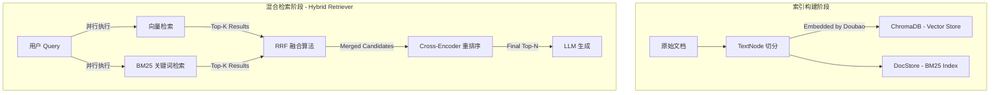

# 工业级 RAG 架构设计：混合检索 + RRF + Rerank

本文详细说明工业界主流的 RAG 架构设计思路，摒弃简单的 naive RAG，采用 **混合检索 (Hybrid Search)** + **重排序 (Re-rank)** 架构，确保检索的高准确率和高召回率。

## 1. 核心架构概览

RAG 系统主要由以下核心组件构成：

- **Embedding 模型**: 豆包 (Doubao-Embedding-Vision)
- **向量数据库**: ChromaDB
- **索引管理**: LlamaIndex Framework
- **检索策略**:
  1. **多路召回**: 同时进行 **向量检索 (Vector)** 和 **关键词检索 (BM25)**
  2. **结果融合**: 使用 **RRF (Reciprocal Rank Fusion)** 算法合并两路结果
  3. **精细排序**: 使用本地 **Cross-Encoder** 模型进行语义重排序

流程图如下：



---

## 2. 详细实现逻辑

### 阶段一：索引构建 (Indexing)

使用 `LlamaIndexManager` 来统一管理索引生命周期。

1. **文档处理**:
   - 将 `Document` 对象转换为 LlamaIndex 的 `TextNode`
   - 继承元数据（source, title 等）

2. **双重存储**:
   - **Vector Store**: 节点文本被发送给 `DoubaoEmbedding` 模型生成向量，存入 **ChromaDB**
   - **DocStore**: 原始节点、文本和关系被存入 `SimpleDocumentStore` (JSON文件)，用于 BM25 索引构建

### 阶段二：混合检索 (Hybrid Retrieval)

这是核心逻辑，由 `HybridRetriever` 类实现。

#### 2.1 BM25 原理与存储

**核心原理**: BM25 (Best Match 25) 是一种基于概率的检索模型，是对 TF-IDF 的改进。

- **TF (Term Frequency)**: 词频。词出现的次数越多，越相关。BM25 对此做了饱和处理（k1 参数），即词频增加到一定程度后，得分增长变缓
- **IDF (Inverse Document Frequency)**: 逆文档频率。如果一个词（如"的"）在所有文档都出现，它的权重就低；反之（如"Langfuse"）越稀有，权重越高
- **Document Length Normalization**: 文档长度归一化。短文档中出现一次关键词，比长文档中出现一次更有分量。BM25 会惩罚过长的文档（b 参数）

**存储结构 (倒排索引)**:

- BM25 不存储向量，而是构建**倒排索引 (Inverted Index)**
- 结构类似字典：`{ "Langfuse": [Doc1, Doc3], "配置": [Doc2, Doc3] }`
- BM25 索引是基于 `SimpleDocumentStore` 在**内存中**构建的，每次服务启动时会重新计算统计信息（TF/IDF）以构建倒排表

#### 2.2 多路召回 (Multi-path Retrieval)

针对同一个 Query，系统并行执行两种检索：

| 检索方式 | 擅长场景 | 示例 |
| :--- | :--- | :--- |
| **Vector Search** | 捕捉语义相关性，概念性、描述性问题 | "什么是 RAG？" |
| **BM25 Search** | 捕捉关键词精确匹配，专有名词、特定 ID | "错误码 502 怎么办？" |

#### 2.3 RRF 原理详解 (Reciprocal Rank Fusion)

RRF 是一种主要基于排名的融合算法，它不依赖于分数的具体数值，而是依赖于排名的相对顺序。

**核心痛点**: Vector 的分数（如 0.85）和 BM25 的分数（如 12.5）不在一个量级，无法直接加权相加。

**算法逻辑**:

$$
Score(d) = \sum_{r \in R} \frac{1}{k + rank(d, r)}
$$

- **倒数加和**: 排名越靠前（Rank 越小），分母越小，得分越高
- **平滑常数 k**: 通常取 60。它的作用是减缓头几名之间的差距，防止某个文档仅因为在某一路排第一就直接统治总榜

**优势**: 鲁棒性极强。它能有效筛选出在两路召回中都表现不错的"稳健型"文档。

#### 2.4 Cross-Encoder 重排序原理 (Re-ranking)

这是 RAG 流程中提升精度的关键一步，使用的是基于 Transformer 的 Cross-Encoder 架构。

**Bi-Encoder VS Cross-Encoder**:

| 模型 | 计算方式 | 优点 | 缺点 |
| :--- | :--- | :--- | :--- |
| **Bi-Encoder (双塔)** | Query 和 Document **分别**独立计算向量 | 快（可预先索引） | 丢失深度交互信息 |
| **Cross-Encoder (单塔)** | `[CLS] Query [SEP] Document [SEP]` 拼接后送入 BERT | 全员交互，精度高 | 慢，需实时推理 |

**注意力机制 (Self-Attention)**:

在 Transformer 内部，Query 中的每个 token 都能与 Document 中的每个 token 进行**全员交互 (Full Self-Attention)**。这意味着模型可以"看到"具体的细节匹配。例如：Query 里的"不"字可以直接影响 Document 里对应动词的权重。

**输出**: 最终取 `[CLS]` 位置的向量输出，经过一个分类层 (Linear Layer)，直接输出一个 0~1 之间的相关性概率。

**代价与权衡**:

- 因为要实时对每一对 (Query + Doc) 进行繁重的 Transformer 推理，速度慢
- **策略**: 只对 RRF 筛选出的 Top-20 文档进行 Cross-Encoder 重排，从中选出 Top-4。这是精度与速度的最佳平衡点
- **推荐模型**: `ms-marco-MiniLM-L-6-v2`，专门在 MS MARCO 数据集（百万级问答数据）上微调，擅长判断"这个问题是不是由这个段落回答的"

---

## 3. 关键配置参数

| 组件 | 参数项 | 默认值/说明 |
| :--- | :--- | :--- |
| **Embedding** | Model | `doubao-embedding-vision-251215` (通过 ARK API) |
| **Reranker** | Model Type | `balanced` (ms-marco-MiniLM-L-6-v2) |
| | Options | `fast` (L-2), `quality` (L-12), `multilingual` |
| **Retrieval** | `vector_top_k` | 10 (单路召回数量) |
| | `bm25_top_k` | 10 (单路召回数量) |
| | `final_top_k` | 4 (最终给 LLM 的数量) |
| | `k` (RRF) | 60 |

---

## 4. 为什么这样设计？

1. **解决 Embedding 缺陷**: 纯向量检索在匹配"精确指令"或"如 CRM-001 这样的专业代号"时效果极差，BM25 完美互补

2. **解决分数不可比**: RRF 避免了该如何加权 Vector Score (0.85) 和 BM25 Score (12.5) 的难题

3. **提升准确率**: Cross-Encoder 虽然慢，但只对前 10-20 个结果计算，耗时可控（几十毫秒），却能带来检索质量质的飞跃（Recall@K 提升显著）

---

## 5. 关键文档处理策略：分词与切分

在 Embedding 化之前，文档切分是决定检索质量的第一道门槛。本项目采用了 **Recursive Character Text Splitting (递归字符切分)** 策略。

### 5.1 递归切分逻辑 (`RecursiveCharacterTextSplitter`)

不同于简单的"每 500 字一刀"，递归切分会尝试按照语义层级进行分割，以保持句子的完整性。

**优先分隔符列表**: `["\n\n", "\n", " ", ""]`

1. **Level 1**: 先尝试用 `\n\n` (段落) 切分。如果切出来的一块小于 `chunk_size`，就保留
2. **Level 2**: 如果某一段太长，超过了 `chunk_size`，则在该段内尝试用 `\n` (句子) 再次切分
3. **Level 3**: 还是太长，则用空格切分
4. **Level 4**: 最后才强制按字符截断

### 5.2 参数配置

- **Chunk Size (块大小)**: 默认为 `1000` 字符
  - 这个大小通常包含 2-3 个完整段落，足够 LLM 理解上下文，又不会因为太长导致检索噪音
- **Chunk Overlap (块重叠)**: 默认为 `200` 字符
  - **作用**: 防止关键信息被切断。例如"错误码 502 的解决方案是..."这句话如果正好在切分点上，重叠机制保证了这句话完整地出现在 Chunk A 的结尾和 Chunk B 的开头

### 5.3 元数据继承

切分后的每个 Chunk **必须**继承原始文档的 Metadata：

- `title`: 原始文档标题（如 "Langfuse 部署指南"）
- `source`: 来源 URL 或文件名
- `chunk_index`: 它是第几块
- **作用**: 在检索时，即便 Chunk 内容只是"点击确认按钮"，LLM 也能通过 `title` 知道这是"部署指南"里的确认按钮，而不是"删除账号"里的

---

## 6. 生产环境升级指南：ElasticSearch 实现 BM25

在生产环境（数据量 > 100k 或对中文分词有极高要求），建议将内存版 BM25 迁移至 ElasticSearch (ES)。

### 6.1 为什么选 ES？

- **持久化**: 索引存在磁盘，服务重启无需重建索引
- **专业分词**: 支持 IK 分词器，比简单的空格分词更懂中文

### 6.2 分词器选择 (Analyzer)

- **ik_max_word**: 会将文本做最细粒度的拆分
  - 例："中华人民共和国" -> "中华人民共和国"、"中华"、"华人"、"人民共和国"、"人民"、"共和国"
  - **优势**: 最大化召回率 (Recall)。只要搜其中任何一个词都能找到
- **ik_smart**: 做最粗粒度的拆分
  - 例："中华人民共和国" -> "中华人民共和国"
  - **优势**: 节省存储空间，搜索更精准
- **推荐策略**: **索引时用 `ik_max_word`** (保证能被搜到)，**搜索时用 `ik_smart`** (保证搜得准)

### 6.3 ES 索引 Mapping 示例

```json
PUT /rag_index
{
  "settings": {
    "analysis": {
      "analyzer": {
        "my_analyzer": {
          "tokenizer": "ik_max_word"
        }
      }
    }
  },
  "mappings": {
    "properties": {
      "content": {
        "type": "text",
        "analyzer": "my_analyzer",
        "search_analyzer": "ik_smart"
      },
      "embedding": {
        "type": "dense_vector",
        "dims": 1536
      },
      "metadata": { "type": "object" }
    }
  }
}
```

---

## 7. 总结

工业级 RAG 系统的核心设计理念：

```
多路召回 (高召回率) → RRF 融合 (公平合并) → Cross-Encoder 重排 (高精度)
```

这套架构在保证召回率的同时，通过重排序大幅提升了最终结果的相关性，是当前业界验证有效的主流方案。
