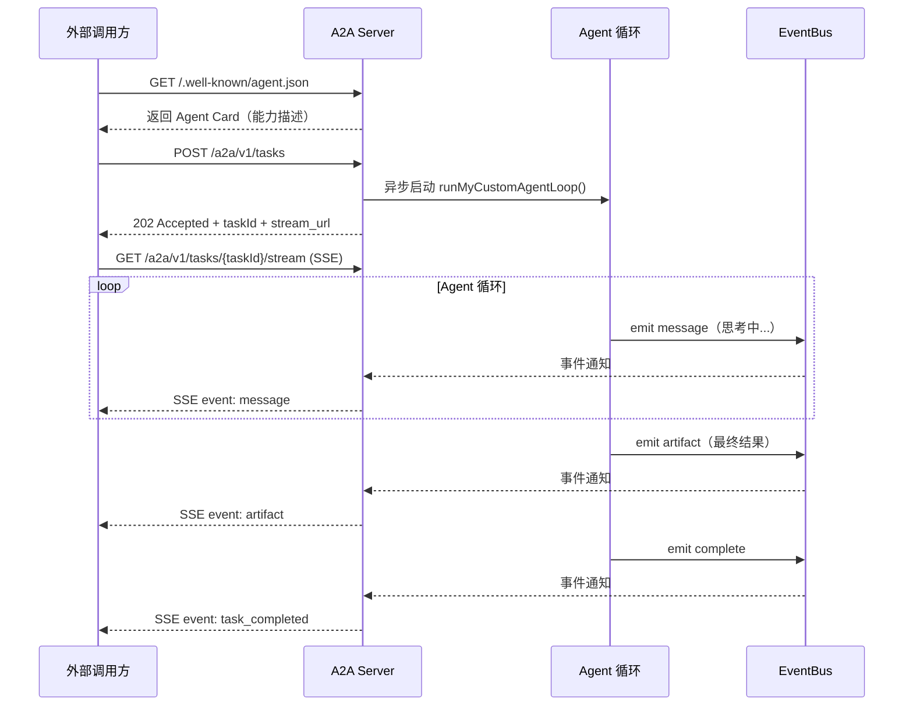
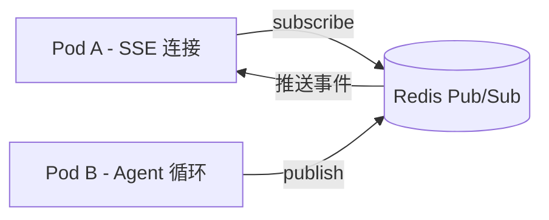

# Node.js 实现 A2A Server（Agent-to-Agent 协议服务端）

## 概述

本文的重点不是让你的 Agent 去做"客户端"调用别人，而是**把你自己写的 Node.js Agent 包装成一个 A2A Server 服务**，将它暴露出去，让其他系统（或者其他 Agent）通过 A2A 协议来调用你的能力。

要实现这一点，在 Node.js（通常基于 Express 或 Koa）中，核心难点在于**"如何解耦 HTTP 请求和耗时极长的本地 Agent `while` 循环"**。

你需要对外暴露三个标准的 API 接口。以下是基于 Express 框架的完整落地方案，并使用 Node.js 原生的 `EventEmitter` 来解决长连接和异步任务流转的问题。

## 核心架构思路

1. **服务发现 (Agent Card):** 暴露一个静态 JSON，告诉外部你的 Agent 能干什么。
2. **任务接收 (Task Create):** 接收请求，生成 `taskId`，**立刻返回 202 Accepted**，并在后台异步启动你的自定义 Agent 循环。
3. **流式输出 (SSE Stream):** 外部调用方带着 `taskId` 连上来，你的 Agent 循环在执行过程中，通过事件总线（Event Bus）把内部状态实时推送到这个 HTTP 长连接里。



## 完整 Node.js 示例代码（基于 Express）

```javascript
const express = require('express');
const EventEmitter = require('events');
const crypto = require('crypto');

const app = express();
app.use(express.json());

// 全局事件总线，用于跨请求的通信（异步 Agent 循环 -> SSE 响应流）
const agentEventBus = new EventEmitter();
```

### 接口 1: 暴露 Agent Card（服务发现）

外部调用方会先 GET 这个接口，看看你支持什么参数。

```javascript
app.get('/.well-known/agent.json', (req, res) => {
  res.json({
    "a2a_version": "1.0",
    "agent_id": "did:web:your-domain.com:my-custom-agent",
    "name": "My Node.js Agent",
    "description": "这是我自己写的 Agent 服务，可以处理复杂的本地任务。",
    "endpoints": {
      "task_create": "http://localhost:3000/a2a/v1/tasks",
      "task_stream": "http://localhost:3000/a2a/v1/tasks/{task_id}/stream"
    },
    "capabilities": [
      {
        "name": "do_complex_task",
        "input_schema": {
          "type": "object",
          "properties": {
            "query": { "type": "string" }
          },
          "required": ["query"]
        }
      }
    ]
  });
});
```

### 接口 2: 创建任务（Task Create）

外部发起任务，我们立刻返回 202，绝不在这里阻塞等待 LLM 返回。

```javascript
app.post('/a2a/v1/tasks', (req, res) => {
  const { intent, parameters } = req.body.task;
  
  // 生成全局唯一的任务 ID
  const taskId = 'tsk_' + crypto.randomBytes(6).toString('hex');

  // 【核心机制】：把任务丢到后台去跑，不阻塞当前 HTTP 响应
  // 这里调用你自定义的 Agent 循环
  runMyCustomAgentLoop(taskId, parameters).catch(err => {
    console.error(`Task ${taskId} failed:`, err);
    // 触发失败事件，通知正在监听的 SSE 连接
    agentEventBus.emit(`${taskId}:error`, err.message);
  });

  // 立刻告诉客户端：任务已收悉，请去这个流地址监听进度
  res.status(202).json({
    task_id: taskId,
    status: "pending",
    stream_url: `http://localhost:3000/a2a/v1/tasks/${taskId}/stream`
  });
});
```

### 接口 3: 状态监听与工件获取（SSE Stream）

客户端连上这个接口，等待你在 `runMyCustomAgentLoop` 中 push 出来的消息。

```javascript
app.get('/a2a/v1/tasks/:taskId/stream', (req, res) => {
  const taskId = req.params.taskId;

  // 设置 Server-Sent Events 的标准 Header
  res.setHeader('Content-Type', 'text/event-stream; charset=utf-8');
  res.setHeader('Cache-Control', 'no-cache');
  res.setHeader('Connection', 'keep-alive');

  // 定义事件监听器
  const onMessage = (data) => {
    res.write(`event: message\ndata: ${JSON.stringify(data)}\n\n`);
  };

  const onArtifact = (data) => {
    res.write(`event: artifact\ndata: ${JSON.stringify(data)}\n\n`);
  };

  const onComplete = () => {
    res.write(
      `event: task_completed\ndata: ${JSON.stringify({
        status: "success",
        task_id: taskId,
      })}\n\n`
    );
    res.end(); // 结束 HTTP 响应
    cleanUp();
  };

  const onError = (errMsg) => {
    res.write(
      `event: error\ndata: ${JSON.stringify({
        status: "failed",
        reason: errMsg,
      })}\n\n`
    );
    res.end();
    cleanUp();
  };

  // 绑定事件到这一个特定的 taskId 上
  agentEventBus.on(`${taskId}:message`, onMessage);
  agentEventBus.on(`${taskId}:artifact`, onArtifact);
  agentEventBus.on(`${taskId}:complete`, onComplete);
  agentEventBus.on(`${taskId}:error`, onError);

  // 客户端断开连接时的清理（防止内存泄漏）
  req.on('close', cleanUp);

  function cleanUp() {
    agentEventBus.removeListener(`${taskId}:message`, onMessage);
    agentEventBus.removeListener(`${taskId}:artifact`, onArtifact);
    agentEventBus.removeListener(`${taskId}:complete`, onComplete);
    agentEventBus.removeListener(`${taskId}:error`, onError);
  }
});
```

### 核心业务逻辑：自己写的 Agent 循环

```javascript
async function runMyCustomAgentLoop(taskId, parameters) {
  let loopCount = 0;
  let isDone = false;

  // 模拟给客户端发送一条"思考中"的状态
  agentEventBus.emit(`${taskId}:message`, {
    type: "status",
    content: `接收到任务参数: ${JSON.stringify(parameters)}，开始初始化大模型上下文...`,
  });

  // 模拟你的 while 循环耗时操作
  while (loopCount < 3 && !isDone) {
    loopCount++;

    // 模拟 LLM 推理耗时 (比如每次思考 2 秒)
    await new Promise((resolve) => setTimeout(resolve, 2000));

    // 把内部循环的状态暴露出去
    agentEventBus.emit(`${taskId}:message`, {
      type: "thinking",
      content: `第 ${loopCount} 轮迭代：正在执行工具调用或思考逻辑...`,
    });
  }

  // 循环结束，生成最终的交付物 (Artifact)
  const finalResult = {
    type: "markdown",
    content: `### 任务完成\n基于你的输入 \`${parameters.query}\`，我已经得出最终结论。`,
    metadata: { loops: loopCount, internal_cost: 0.02 },
  };

  // 1. 发送最终工件
  agentEventBus.emit(`${taskId}:artifact`, finalResult);
  // 2. 发送结束信号，让 HTTP 连接优雅关闭
  agentEventBus.emit(`${taskId}:complete`);
}

// 启动服务
app.listen(3000, () => {
  console.log('A2A Node.js Agent 服务已启动: http://localhost:3000');
});
```

## 关键改造点说明

### 1. 从 `console.log` 升级为 `agentEventBus.emit`

之前你自己写的 Agent，在循环里查资料、调模型，可能只是通过 `console.log` 打印日志。现在，你只需要把原本打印日志的地方，改成 `agentEventBus.emit('${taskId}:message', {...})`。外部的调用方就会在他们的终端里实时看到你这个 Agent 的"思考过程"。

### 2. 异步非阻塞（Fire and Forget）

在 `POST /a2a/v1/tasks` 中，你直接调用 `runMyCustomAgentLoop()` 但**不要** `await` 它。因为你一旦 `await`，如果 LLM 思考了三分钟，你这边的 HTTP 请求就会超时被掐断。让它在后台默默跑，跑出结果了用 EventBus 通知即可。

### 3. 高并发与持久化（进阶建议）

在上面这个简单的例子中，我使用了 Node.js 原生的 `EventEmitter`（单机内存）。如果你的服务重启，进行到一半的任务状态就会丢失。在真实的生产环境（比如部署到 Kubernetes 时）：

- 把生成的 `taskId` 存入 **Redis**。
- 把状态推送用 **Redis Pub/Sub** 替换原生的 `EventEmitter`。
- 这样即使 Server 有多个 Pod 实例，长连接连到了 A 节点，Agent 循环在 B 节点执行，依然可以通过 Redis Pub/Sub 把最终状态推给客户端。


