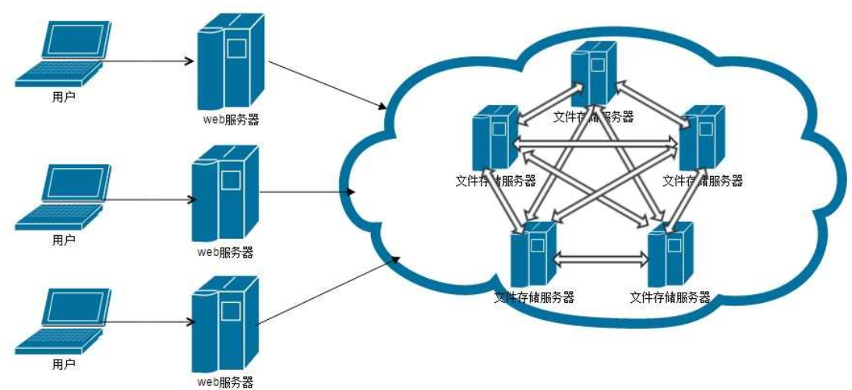

# 分布式文件系统

## 介绍

分布式文件系统（Distributed File System, DFS）是一种使用网络技术把文件系统扩展到多台不同的机器（通常跨越多个物理位置）上的文件系统。与集中式文件系统不同，分布式文件系统使用户能够访问不仅仅是本地文件系统中的文件，还可以访问远程计算机上的文件，就像它们位于本地硬盘上一样。

## 主流文件系统

1. HDFS（Hadoop Distributed File System）：用于存储大数据的分布式文件系统。
2. GlusterFS：用于大规模网络存储的分布式文件系统。
3. Ceph：一个高度可扩展的分布式存储解决方案。
4. Amazon EFS（Elastic File System）：AWS 提供的分布式文件存储服务。
5. Microsoft DFS：用于 Windows 网络的分布式文件系统。
6. NFS（Network File System）：虽然不是一个纯粹的分布式文件系统，但它允许用户通过网络访问其他计算机上的文件。

## 项目选型

### minio

学成在线项目选型

开源解决方案：适用于组织希望自行管理和运行对象存储服务。
高性能：为高吞吐量工作负载进行了优化。
简单性：易于安装和配置。
兼容性：与Amazon S3 API兼容，方便迁移。

### 阿里云oss

个人开发选型。

商业解决方案：由阿里云提供，是一种成熟的云存储解决方案。
高可用性和可扩展性：设计用于高弹性和可扩展性。
多地域支持：可以在全球范围内的多个数据中心内存储数据。
安全性：提供多层次的安全防护。

## 说明

阿里云OSS（Object Storage Service）和MinIO都不是传统意义上的文件系统，而是对象存储系统。对象存储是一种存储架构，用于处理非结构化数据和可扩展性，它以对象的形式存储数据，并允许你通过API或HTTP/HTTPS来存储、检索和管理数据。

但严格说来，它们并不替代如HDFS, GlusterFS等分布式文件系统，而是与之互补。对象存储通常用于大规模数据存储，特别是非结构化数据，如图片、视频、备份、大数据等，而分布式文件系统则更多用于需要文件层次结构和高度一致性的场景。
