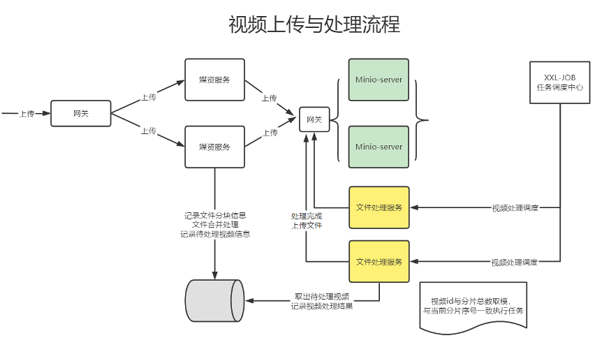

# 分布式任务调度

## 定义

分布式任务调度是一种在多台机器或集群环境中自动分发和执行任务的技术。它通常包含任务队列、任务分配、负载均衡、故障转移和其他高级功能。

## 功能和特点

任务队列：所有待执行的任务首先进入一个任务队列。
任务分配：根据某种算法，任务被分配到各个工作节点上。
负载均衡：系统自动判断哪些节点处于空闲状态，并将任务合理地分配给它们。
故障转移：如果某个节点失败，其上的任务会被重新分配到其他健康节点。
任务依赖：复杂任务可能需要多个子任务按照特定的顺序执行。

## 常用工具和框架

-   Apache Airflow
-   Celery
-   Kubernetes CronJob
-   Quartz
-   Zookeeper

## 任务场景（Task Scenarios）

1. 数据处理

大规模数据处理场景，如数据分析、数据同步等。

2. 定时任务

例如每天凌晨进行数据库备份，或者定时生成报告。

3. 服务治理

在微服务架构中，根据服务的健康状况或其他指标，动态地调整服务的分配。

4. 工作流管理

需要多个任务按照特定的顺序或条件执行，例如电商网站的订单处理流程。

5. 资源监控

在多节点环境中，定时或按需收集各个节点的性能数据。

6. 批量作业

比如邮件发送、消息推送等需要大量并行执行的任务。

## 技术选型

XXL-JOB 是一个开源的分布式任务调度平台，它主要面向企业级应用，支持多种任务调度方式，包括：CRON表达式、延迟调度、API触发等。与我之前提到的一些框架和工具相比，XXL-JOB 有以下几个特点：

### 优点：

易用性：XXL-JOB 提供了非常直观和友好的界面，以便进行任务管理和监控。

扩展性：由于它是一个专门针对任务调度设计的平台，因此在任务调度方面具有很高的扩展性。

灵活性：支持多种任务调度方式和多种任务类型，也支持自定义任务处理逻辑。

健壮性和高可用：支持任务失败重试、失败转移以及报警通知等，提高了系统的健壮性和可用性。

支持多语言：虽然主体是 Java 实现，但通过HTTP接口也支持其他语言。

社区活跃：国内有很多企业在使用，因此遇到问题时，相对容易找到解决方案或者得到社区的支持。

### 缺点：

复杂性：由于功能丰富，对于简单的任务调度需求可能会显得过于复杂。

依赖性：如果你的应用并不是基于 Java 或者你不希望引入太多外部依赖，那么XXL-JOB可能不是一个理想的选择。

学习曲线：相对于一些更简单的任务调度库或者工具，XXL-JOB 有一定的学习曲线。

## 分片广播

并行处理，效率提高。

