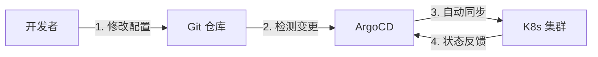

# K8s 部署方案全景图（2024-2025）

K8s 的部署通常指两个层面的含义：

1. **基础设施层**：从零搭建一个 K8s **集群**（安装 K8s）。
2. **应用层**：把你的服务**部署到** K8s 集群中。

---

## 第一部分：如何搭建 K8s 集群（基础设施层）

现在几乎没人会手动去敲二进制文件安装了。根据你的场景，选择最适合的工具：

### 1. 个人开发 / 学习 / 测试

如果你只是想在本地电脑（Mac/Windows/Linux）上跑个 K8s 玩玩：

#### Minikube / Kind

最经典的方案。

- **特点**：基于 Docker 运行 K8s，轻量级。
- **适用**：学习 K8s 命令，测试简单的 Yaml。

```bash
# Minikube
minikube start

# Kind (Kubernetes in Docker)
kind create cluster
```

#### Docker Desktop

最无脑的方案。

- **操作**：打开设置 -> 勾选 `Enable Kubernetes`。
- **适用**：Mac/Windows 用户，仅仅需要一个 K8s 端点。

#### Sealos（强烈推荐国内用户）

国产神器。只需一条命令，无需翻墙。它把所有需要的镜像（docker images）都打包好了，完全避开了国内下载 `k8s.gcr.io` 镜像失败的痛苦。

```bash
sealos run labring/kubernetes:v1.25.0 --masters 192.168.0.1 --nodes 192.168.0.2
```

### 2. 生产环境 - 公有云（最省心）

如果是公司业务上云，不要自己搭建，直接买托管服务。

| 云厂商 | 服务名称 |
| --- | --- |
| AWS | EKS (Elastic Kubernetes Service) |
| Google Cloud | GKE (Google Kubernetes Engine) |
| Azure | AKS (Azure Kubernetes Service) |
| 阿里云 | ACK (容器服务 Kubernetes 版) |
| 腾讯云 | TKE (Tencent Kubernetes Engine) |

**理由**：Master 节点由云厂商托管，你只需要管 Worker 节点。高可用、升级、打补丁都不用你操心。

### 3. 生产环境 - 自建机房 / 裸金属（最硬核）

如果你必须在自己的物理机或虚拟机上搭建：

#### Kubeadm

K8s 官方的标准安装工具。

- **地位**：类似"教科书"式的安装，不仅能装，还是考 CKA 认证的必考内容。
- **缺点**：国内网络环境需要配置镜像源（阿里云/网易云等）。

```bash
# 初始化 Master 节点
kubeadm init --pod-network-cidr=10.244.0.0/16

# Worker 节点加入集群
kubeadm join <master-ip>:6443 --token <token> --discovery-token-ca-cert-hash sha256:<hash>
```

#### Kubespray

基于 Ansible 的自动化部署工具。

- **适用**：运维团队熟悉 Ansible，需要管理成百上千台服务器的大规模集群。

#### K3s

轻量级 Kubernetes 发行版。

- **适用**：边缘计算、物联网设备、配置很低的服务器（比如树莓派）。它是一个"瘦身版"的 K8s。

```bash
# 安装 K3s (单命令)
curl -sfL https://get.k3s.io | sh -
```

### 集群搭建方案对比

| 方案 | 适用场景 | 难度 | 生产级别 |
| --- | --- | --- | --- |
| Docker Desktop | 本地开发 | ⭐ | ❌ |
| Minikube / Kind | 学习测试 | ⭐⭐ | ❌ |
| Sealos | 国内快速搭建 | ⭐⭐ | ✅ |
| 云厂商托管 | 企业生产 | ⭐ | ✅✅✅ |
| Kubeadm | 自建生产 | ⭐⭐⭐⭐ | ✅✅ |
| Kubespray | 大规模集群 | ⭐⭐⭐⭐⭐ | ✅✅✅ |
| K3s | 边缘/IoT | ⭐⭐ | ✅ |

---

## 第二部分：如何把应用部署到 K8s（应用层）

集群有了，怎么把你的 Docker 镜像跑上去？这是目前演进的路线：

### Level 1: 手工挡 (kubectl)

直接使用 kubectl 命令操作。

- **做法**：写 `deployment.yaml`，然后 `kubectl apply -f ...`
- **场景**：调试、临时测试、学习。

```bash
kubectl apply -f deployment.yaml
kubectl get pods
kubectl logs <pod-name>
```

### Level 2: 模版挡 (Helm)

使用 Helm 包管理器。

- **做法**：写 `Chart` 包，用 `helm install ...`
- **场景**：CI/CD 流水线、复杂应用交付、开源软件安装（如安装 Prometheus, Redis 等）。

```bash
# 安装应用
helm install my-app ./my-chart --set image.tag=v1.0.0

# 升级应用
helm upgrade my-app ./my-chart --set image.tag=v2.0.0

# 回滚
helm rollback my-app 1
```

### Level 3: 自动驾驶 (GitOps) —— 目前的行业标准

这是现在最火的部署方式。核心理念是：**Git 仓库是唯一的真理（Single Source of Truth）**。

你不再直接操作 K8s 集群，你只操作 Git。

#### 主流工具

- **ArgoCD**：最流行的 GitOps 工具，有漂亮的 Web UI。
- **Flux**：CNCF 毕业项目，更轻量级。

#### GitOps 工作流程



1. 你把 Yaml 或 Helm Chart 提交到 Git 仓库。
2. **ArgoCD**（部署在 K8s 里）检测到 Git 变了。
3. ArgoCD 自动把 Git 里的新配置**同步（Sync）**到 K8s 集群中。

#### GitOps 优势

| 优势 | 说明 |
| --- | --- |
| **可追溯** | 谁改了配置，Git Log 一清二楚 |
| **防漂移** | 如果有人偷偷用 `kubectl` 改了线上配置，ArgoCD 会发现"集群状态"和"Git 状态"不一致，并自动改回来（Self-healing） |
| **审计合规** | 所有变更都有 PR/MR 记录，满足企业审计要求 |
| **灾难恢复** | 集群挂了？重新指向 Git 仓库即可恢复 |

### 应用部署方式演进对比

| Level | 方式 | 特点 | 适用场景 |
| --- | --- | --- | --- |
| 1 | kubectl | 手动、直接 | 调试、学习 |
| 2 | Helm | 模板化、可复用 | CI/CD、复杂应用 |
| 3 | GitOps | 自动化、可追溯 | 生产环境最佳实践 |

---

## 总结

### 选择建议

**搭建集群：**

- 学习/开发 → Minikube 或 Docker Desktop
- 国内快速搭建 → Sealos
- 企业生产 → 云厂商托管（EKS/GKE/ACK）
- 自建机房 → Kubeadm + Kubespray

**部署应用：**

- 刚入门 → 先用 kubectl 理解原理
- 项目实战 → 用 Helm 管理复杂应用
- 生产环境 → GitOps（ArgoCD/Flux）

> **一句话总结**：用 Minikube 学原理，用 Helm 打包应用，用 ArgoCD 做自动化部署。
