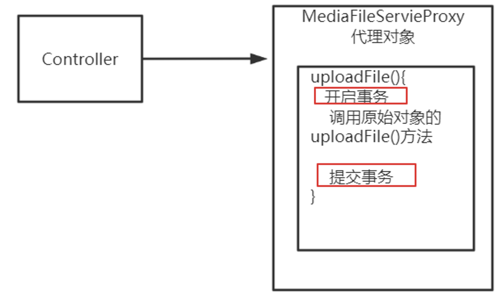

# qa

## 问题1

**为什么在 Spring Cloud 微服务环境中，配置文件通常命名为 bootstrap.yml 或 bootstrap.properties，而不是传统的 Spring Boot 应用中使用的 application.yml 或 application.properties?**

这是因为 `bootstrap.yml` 是在应用程序的引导阶段（`Bootstrap Phase`）读取的，这一阶段早于应用程序的完全启动和读取 `application.yml` 文件。在这个引导阶段，应用可能需要从配置服务器加载额外的配置信息，或者做其他与服务发现和微服务环境相关的初始化工作。

简而言之，bootstrap.yml 主要用于：

-   Spring Cloud Config Server 的客户端配置：在微服务体系中，这用于定义如何连接到配置服务器以获取应用程序的配置信息。

-   服务发现：如果你使用像 Eureka 这样的服务发现组件，bootstrap.yml 会被用于配置如何注册和发现服务。

-   任何在应用程序启动早期需要的设置：这包括各种需要在 application.yml 之前加载的配置。

如果你的项目不是一个 Spring Cloud 项目或者不需要这些特殊的早期配置，通常使用 application.yml 或 application.properties 就足够了。

## 问题2

**swagger文档url**

```url
http://localhost:63050/media/swagger-ui.html
```

## 问题3

**Transactional注解使用指南**

Transactional注解内部通过代理对象实现，所以事务只能用在代理对象中，如果在实现中直接调用会导致事务不生效的情况，此时需要转换为代理对象。



## 问题4

**MaxUploadSizeExceededException问题**

```yml
spring:
    servlet:
        multipart:
            max-file-size: 100MB
            max-request-size: 100MB
```

# 问题5

什么情况下spring事务会失效？

1. 在方法中捕获事务异常没有抛出去
2. 在非事务方法中调用事务
3. 事务内部方法调用事务方法
4. @Transactional标记分方法为private方法
5. 抛出的异常与指定的异常不匹配
6. 数据库表不支持事务
7. 事务传播行为导致事务失效
