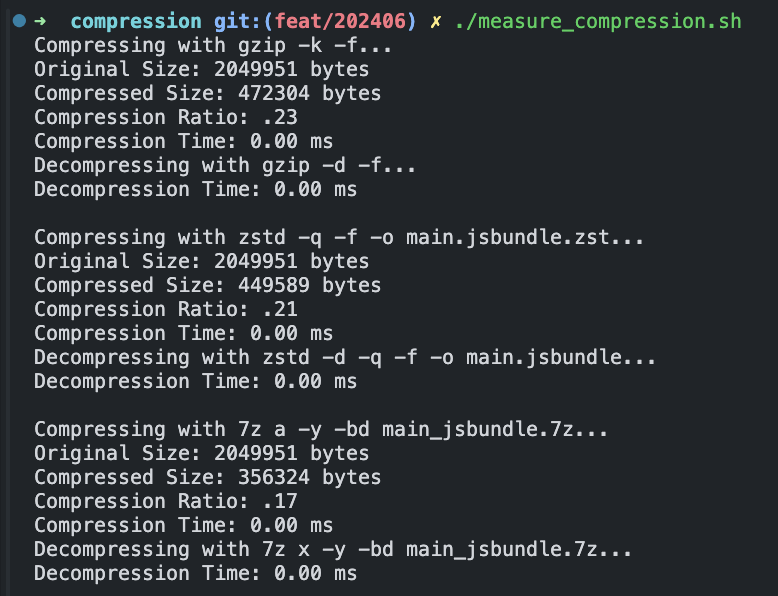

# 压缩方案对比

## 文档

https://tech.meituan.com/2021/01/07/pack-gzip-zstd-lz4.html

## 对比对象

7z/zstd/gzip

## 压缩对象

`main.jsbundle`

## 压缩脚本

```bash
#!/bin/bash

# Function to measure and display compression and decompression metrics
measure_compression() {
    local cmd=$1
    local file=$2
    local compressed_file=$3
    local decompress_cmd=$4

    echo "Compressing with $cmd..."

    # Measure compression time
    start_time=$(date +%s.%N)
    $cmd $file > /dev/null
    end_time=$(date +%s.%N)
    compression_time=$(echo "$end_time - $start_time" | bc)

    original_size=$(stat -f%z "$file")
    compressed_size=$(stat -f%z "$compressed_file")

    # Calculate compression ratio
    compression_ratio=$(echo "scale=2; $compressed_size / $original_size" | bc)

    echo "Compression Ratio: $compression_ratio"
    echo "Compression Time: $compression_time seconds"

    echo "Decompressing with $decompress_cmd..."

    # Measure decompression time
    start_time=$(date +%s.%N)
    $decompress_cmd $compressed_file > /dev/null
    end_time=$(date +%s.%N)
    decompression_time=$(echo "$end_time - $start_time" | bc)

    echo "Decompression Time: $decompression_time seconds"
    echo
}

file="example.txt"
gzip_file="example.txt.gz"
zstd_file="example.txt.zst"
seven_zip_file="example.7z"

# Ensure the example file exists
if [ ! -f "$file" ]; then
    echo "File $file not found!"
    exit 1
fi

# Measure gzip
measure_compression "gzip -k" "$file" "$gzip_file" "gzip -d"

# Measure zstd
measure_compression "zstd -q -o $zstd_file" "$file" "$zstd_file" "zstd -d -q -o /dev/null"

# Measure 7z
measure_compression "7z a -bd $seven_zip_file" "$file" "$seven_zip_file" "7z x -bd -o. $seven_zip_file"

# Clean up
rm -f "$gzip_file" "$zstd_file" "$seven_zip_file"
```

