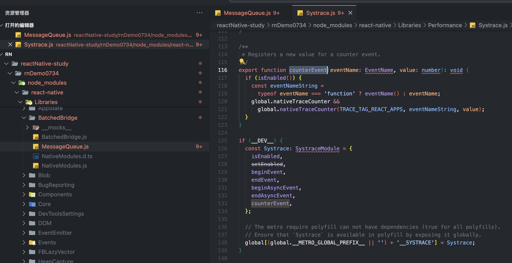
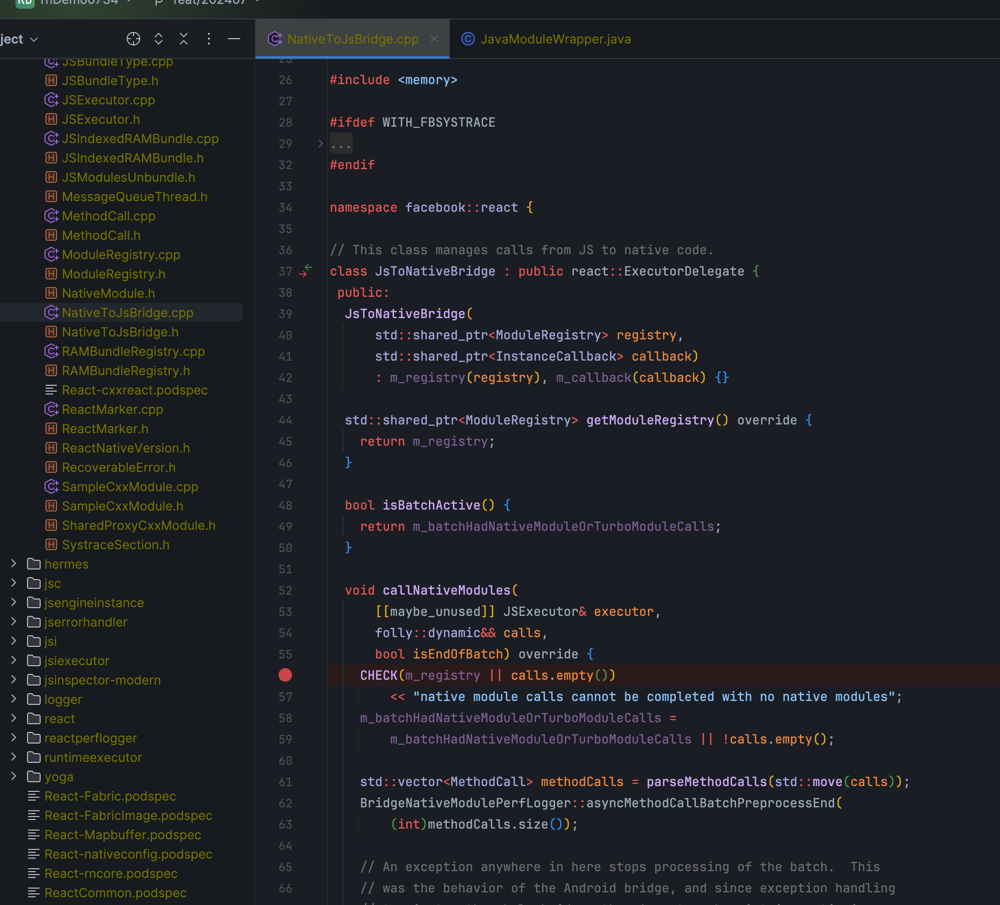
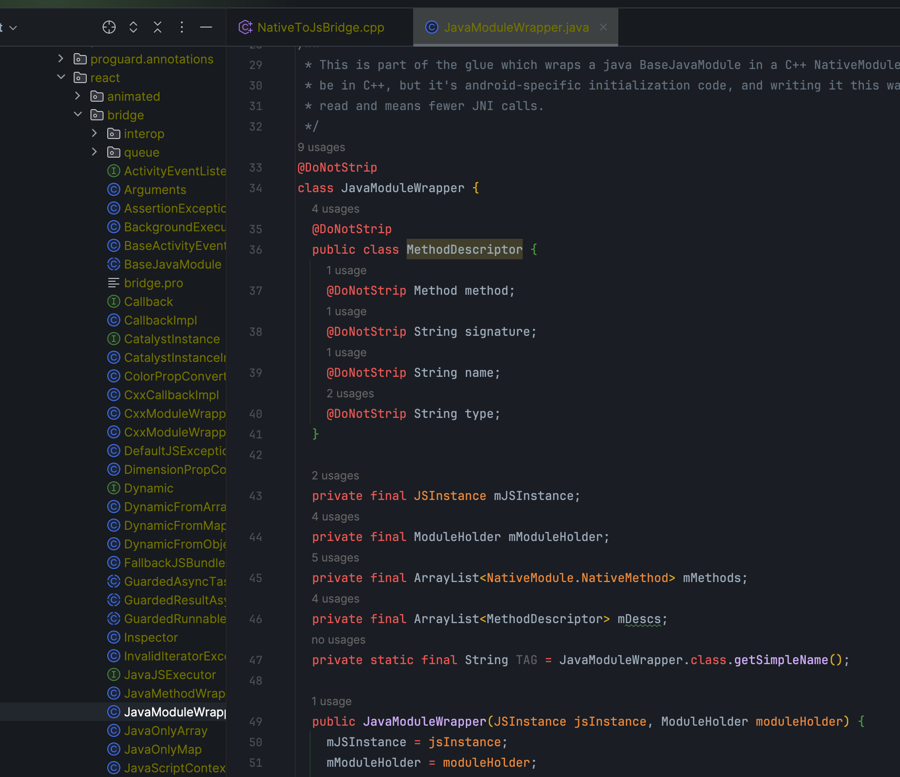

# NativeModules在Android侧的调用逻辑

:::danger
该逻辑是旧架构逻辑，新架构逻辑已经重构。
:::

写了多年的RN代码,今天突然很好奇，js代码是怎么一步一步将数据传输到native然后调用native函数的。经过一晚上的研究，大概找到了他的调用路线。

## 流程

1. js侧创建mq，然后调用`enqueueNativeCall`方法通过`global.nativeTraceCounter`全局注册函数将mq传递给hermes引擎。
2. hermes引擎调用bridge。(此块没有调试)
3. bridge调用`callNativeModules`方法来调用android侧的`java`方法。
4. java侧通过`javamoduleWrapper`通过反射来调用桥接方法。
5. 在android侧实现桥接方法的时候只需要添加`@ReactMethod`注解注册方法就好，底层都做了封装。

