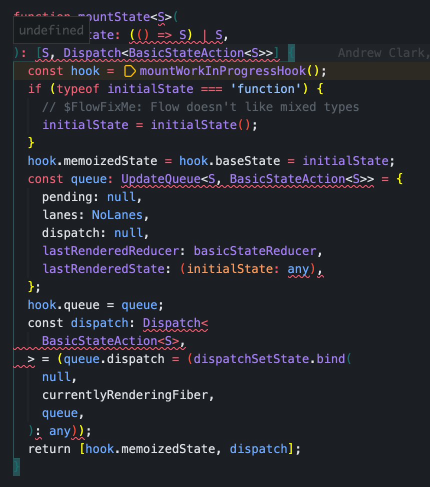

# fiber

## 为什么页面中无法直接打印虚拟树？

我很好奇，我觉得fiber在创建后应该缓存起来，然后下次使用。但是在调研后发现，fiber虚拟树并没有被挂在到全局变量或者缓存中。那么react内部是怎么调用fiber树的，难道凭空产生吗。



从usestate初始化后的产物可以看到，其实在这个地方，已经在内存中绑定了一个fiber。而根据fiber链表特性可知，无论获取到那个fiber节点，那吗一定能够获取虚拟dom树。。。真聪明啊，太离谱了，然而这只是react封装的冰山一角。。。。

这种特性导致了，fiber只能在调试或者reactdevtools可以看到，想要打印没门。。。这封装离谱了。。

## fiber介绍

Fiber 的核心概念

1.	Fiber 节点：Fiber 是一个 JavaScript 对象，它表示 React 应用中的一个虚拟 DOM 节点。每个 Fiber 节点都包含了有关该节点的信息，例如类型、键、状态、更新队列等。
2.	链表结构：Fiber 节点通过链表结构相互连接，每个 Fiber 节点都有指向其父节点、子节点和兄弟节点的引用。这样，React 可以快速地遍历和更新整个组件树。
3.	优先级调度：Fiber 引入了优先级概念，使得 React 可以根据任务的紧急程度决定何时执行哪项任务。例如，用户输入等高优先级任务可以打断低优先级任务，从而提高应用的响应速度。
4.	增量渲染：通过时间切片技术，React 可以将渲染任务拆分成多个小片段，并在每个片段之间进行中断和恢复，从而避免一次性长时间的阻塞渲染。

```
type Fiber = {
  // 类型信息
  tag: WorkTag,               // Fiber 类型，表示是函数组件、类组件、宿主组件等
  key: null | string,         // 用于唯一标识同级别的子节点

  // 元素类型
  elementType: any,           // JSX 类型
  type: any,                  // 实际类型（例如组件类或字符串标签）
  stateNode: any,             // 对应的实际 DOM 节点或组件实例

  // 树结构
  return: Fiber | null,       // 父节点
  child: Fiber | null,        // 子节点
  sibling: Fiber | null,      // 兄弟节点
  index: number,              // 同级别的节点索引

  // 副作用列表
  effectTag: SideEffectTag,   // 需要对该 Fiber 执行的操作
  nextEffect: Fiber | null,   // 下一个需要执行副作用的节点

  // 更新相关
  pendingProps: any,          // 新传入的 props
  memoizedProps: any,         // 上次渲染完成后的 props
  updateQueue: UpdateQueue<any> | null, // 更新队列
  memoizedState: any,         // 上次渲染完成后的 state

  // 工作优先级
  lanes: Lanes,               // 标识该 Fiber 需要处理的 lane
  childLanes: Lanes,          // 子树需要处理的 lane
};
```

### statenode介绍

stateNode 属性用于将 Fiber 节点与实际的 DOM 节点或组件实例关联起来。stateNode 的值因 Fiber 的类型不同而有所不同。以下是一些常见情况：

1. 宿主组件（Host Component）

对于 HTML 元素（例如 div、span 等），stateNode 指向实际的 DOM 节点。示例如下：

```html
<div>Hello, world!</div>
```

对应的 Fiber 节点：

```json
{
  tag: HostComponent,
  type: 'div',
  stateNode: HTMLDivElement, // 对应的实际 DOM 节点
  // 其他属性省略
}
```

2. 类组件（Class Component）

对于类组件，stateNode 指向组件实例。示例如下：
```js
class MyComponent extends React.Component {
  render() {
    return <div>Hello, world!</div>;
  }
}
<MyComponent />
// 对应的 Fiber 节点：
{
  tag: ClassComponent,
  type: MyComponent,
  stateNode: MyComponentInstance, // 组件实例
  // 其他属性省略
}
```
3. 函数组件（Function Component）
对于函数组件，stateNode 通常为 null，因为函数组件没有实例。示例如下：
```js
function MyComponent() {
  return <div>Hello, world!</div>;
}
<MyComponent />
// 对应的 Fiber 节点：
{
  tag: FunctionComponent,
  type: MyComponent,
  stateNode: null, // 函数组件没有实例
  // 其他属性省略
}
```

在创建宿主组件的 Fiber 节点时，会调用 createInstance 方法创建对应的 DOM 元素，并将其赋值给 stateNode：
```js
function createInstance(type, props, rootContainerInstance, hostContext, internalInstanceHandle) {
  const domElement = document.createElement(type);
  // 初始化 DOM 元素的属性和事件监听器
  return domElement;
}

fiber.stateNode = createInstance(fiber.type, fiber.pendingProps, rootContainerInstance, hostContext, fiber);
```