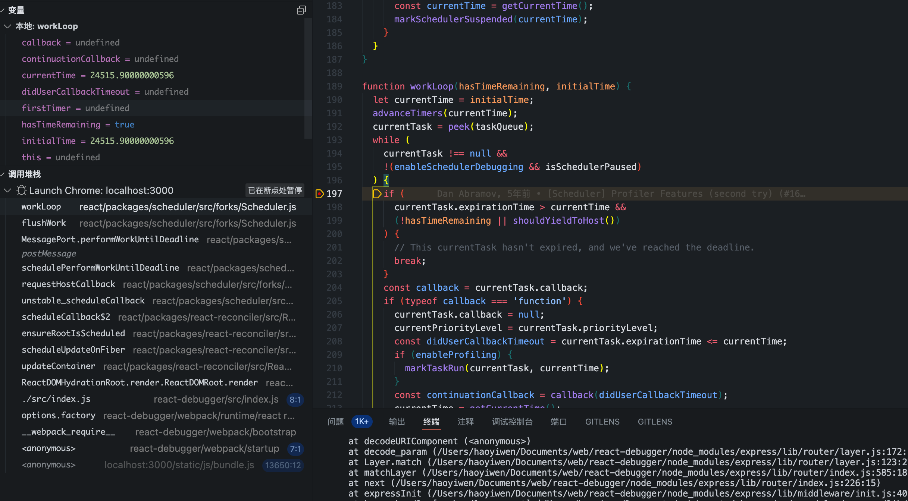

## react运行堆栈

一次从试图创建到真实dom创建的过程。


## ensureRootIsScheduled

任务总调度的地方。只要用时间切片还是不切片，一切看任务优先级。页面初始化的时候优先级是normal优先级，优先级是3。走时间切片渲染。

## performConcurrentWorkOnRoot

这是并发任务的总入口，包括处理渲染工作和提交阶段工作（副作用函数）


## 提交阶段

1. Before Mutation Phase: 在进行任何 DOM 变更之前，React 会处理一些生命周期方法（如 getSnapshotBeforeUpdate），并调用合适的钩子。
2. Mutation Phase: 在这个阶段，React 会实际执行所有需要的 DOM 变更。前面渲染阶段只是创建好了dom节点，但是这里是真的挂在渲染。(commitMutationEffect函数是真正渲染的执行函数)
3. Layout Phase: 在 DOM 变更完成后，React 会处理 componentDidMount 和 componentDidUpdate 生命周期方法，并调用 useLayoutEffect 钩子。
4. Passive Effects Phase: 最后，React 会处理 useEffect 钩子中的副作用。

## 初始化任务调度



在初始化的react事件调度中，在新版浏览器会使用web work在其他线程创建一个事件调度循环，来统一创建fiber，页面更新，副作用函数执行。

## 事件响应

```js
<button onClick={() => setCount(count + 1)}>count++</button>
```


