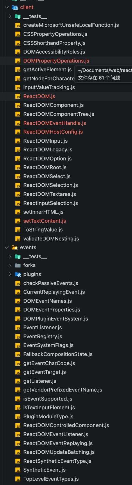
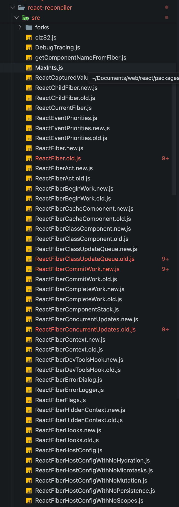
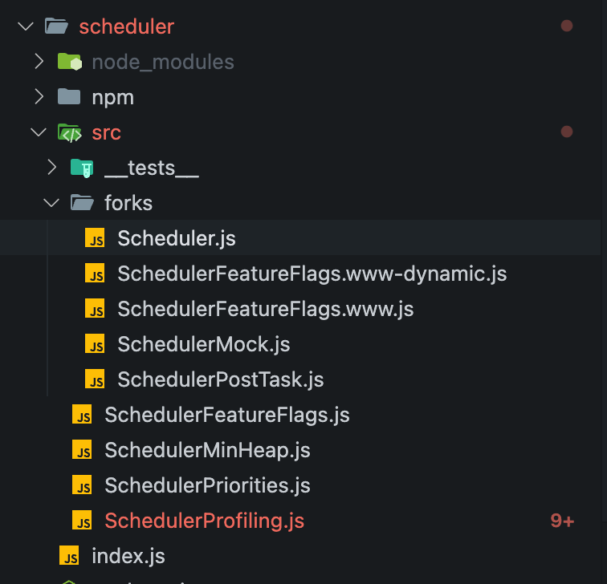

# react组件部分

## react库

react库是开发者常用的库，其中常用的hook和api都在都在这个库中。导出如下。

```js
export {
    __SECRET_INTERNALS_DO_NOT_USE_OR_YOU_WILL_BE_FIRED,
    act as unstable_act,
    // 元素和上下文
    Children,
    Component,
    Fragment,
    Profiler,
    PureComponent,
    StrictMode,
    Suspense,
    SuspenseList,
    cloneElement,
    createContext,
    createElement,
    createFactory,
    createMutableSource,
    createRef,
    createServerContext,
    forwardRef,
    isValidElement,
    lazy,
    memo,
    startTransition,
    // 不稳定的 API
    unstable_Cache,
    unstable_DebugTracingMode,
    unstable_LegacyHidden,
    unstable_Offscreen,
    unstable_Scope,
    unstable_TracingMarker,
    unstable_getCacheSignal,
    unstable_getCacheForType,
    unstable_useCacheRefresh,
    // hook
    useId,
    useCallback,
    useContext,
    useDebugValue,
    useDeferredValue,
    useEffect,
    useImperativeHandle,
    useInsertionEffect,
    useLayoutEffect,
    useMemo,
    useMutableSource,
    useSyncExternalStore,
    useReducer,
    useRef,
    useState,
    useTransition,
    version,
} from './src/React';
```

## react-dom库

此库实际上是`react-dom`, `react-reconciler`和`scheduler`三者打包在一起的产物。也是react库的核心。像fiber切片，批处理和优先级调度都是在这里实现的。

```js
export {
    __SECRET_INTERNALS_DO_NOT_USE_OR_YOU_WILL_BE_FIRED,
    createPortal,
    createRoot,
    hydrateRoot,
    findDOMNode,
    flushSync,
    hydrate,
    render,
    unmountComponentAtNode,
    unstable_batchedUpdates,
    unstable_createEventHandle,
    unstable_flushControlled,
    unstable_isNewReconciler,
    unstable_renderSubtreeIntoContainer,
    unstable_runWithPriority, // DO NOT USE: Temporarily exposed to migrate off of Scheduler.runWithPriority.
    version,
} from './src/client/ReactDOM';
```

### react-dom



从上述代码结构可以很明显的看到，react-dom负责创建dom元素和事件处理。也就是说它是偏dom层的，也就是真实dom的生成和事件响应一侧。

### react-reconciler



从上图可以看到react-reconciler库主要和fiber打交道，也就是主要是负责生成更新fiber节点的，而fiber节点用链表形式构成了一颗影虚拟dom树，从而在状态改变时候能够做到最真实dom树的最小更新。

在图中很容易看到大多数文件下面都有.new.js和.old.js，这个主要是因为协调器有两个版本，在18.2.0使用老版本协调器。

```js
// react-reconciler实际导出，虽然不直接打交道，但是这是整个react web体系的核心
import {
  createContainer as createContainer_old,
  createHydrationContainer as createHydrationContainer_old,
  updateContainer as updateContainer_old,
  batchedUpdates as batchedUpdates_old,
  deferredUpdates as deferredUpdates_old,
  discreteUpdates as discreteUpdates_old,
  flushControlled as flushControlled_old,
  flushSync as flushSync_old,
  isAlreadyRendering as isAlreadyRendering_old,
  flushPassiveEffects as flushPassiveEffects_old,
  getPublicRootInstance as getPublicRootInstance_old,
  attemptSynchronousHydration as attemptSynchronousHydration_old,
  attemptDiscreteHydration as attemptDiscreteHydration_old,
  attemptContinuousHydration as attemptContinuousHydration_old,
  attemptHydrationAtCurrentPriority as attemptHydrationAtCurrentPriority_old,
  findHostInstance as findHostInstance_old,
  findHostInstanceWithWarning as findHostInstanceWithWarning_old,
  findHostInstanceWithNoPortals as findHostInstanceWithNoPortals_old,
  shouldError as shouldError_old,
  shouldSuspend as shouldSuspend_old,
  injectIntoDevTools as injectIntoDevTools_old,
  createPortal as createPortal_old,
  createComponentSelector as createComponentSelector_old,
  createHasPseudoClassSelector as createHasPseudoClassSelector_old,
  createRoleSelector as createRoleSelector_old,
  createTestNameSelector as createTestNameSelector_old,
  createTextSelector as createTextSelector_old,
  getFindAllNodesFailureDescription as getFindAllNodesFailureDescription_old,
  findAllNodes as findAllNodes_old,
  findBoundingRects as findBoundingRects_old,
  focusWithin as focusWithin_old,
  observeVisibleRects as observeVisibleRects_old,
  registerMutableSourceForHydration as registerMutableSourceForHydration_old,
  runWithPriority as runWithPriority_old,
  getCurrentUpdatePriority as getCurrentUpdatePriority_old,
} from './ReactFiberReconciler.old';
```

### scheduler



从图中可以很清晰的看到，schedluer主要是和优先级打交道，这也是react可中断ui更新和事件切片来源。

```js
// 这些是调度器对外暴露的api，可以看到主要是和优先级相关
export {
  ImmediatePriority as unstable_ImmediatePriority,
  UserBlockingPriority as unstable_UserBlockingPriority,
  NormalPriority as unstable_NormalPriority,
  IdlePriority as unstable_IdlePriority,
  LowPriority as unstable_LowPriority,
  unstable_runWithPriority,
  unstable_next,
  unstable_scheduleCallback,
  unstable_cancelCallback,
  unstable_wrapCallback,
  unstable_getCurrentPriorityLevel,
  shouldYieldToHost as unstable_shouldYield,
  unstable_requestPaint,
  unstable_continueExecution,
  unstable_pauseExecution,
  unstable_getFirstCallbackNode,
  getCurrentTime as unstable_now,
  forceFrameRate as unstable_forceFrameRate,
};
```