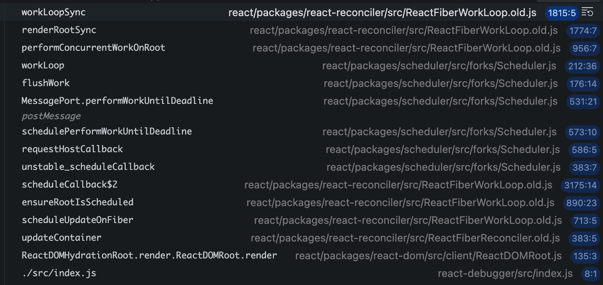

# scheduler解析

~~在页面初始化的时候会调用unstable_scheduleCallback调度一次performSyncWorkOnRoot来初始化渲染工作。~~

不是上面的说法一样，而是schedular只是作为一个调度器。然后交由协调器调用罢了。从下面堆栈可以看到，schedular主要ensureRootIsScheduled进行优先级调度，在不是同步优先级的并发渲染和提交阶段调用scheduler来进行时间切片和任务执行。所以schedular只是一个调度器，低耦合。

